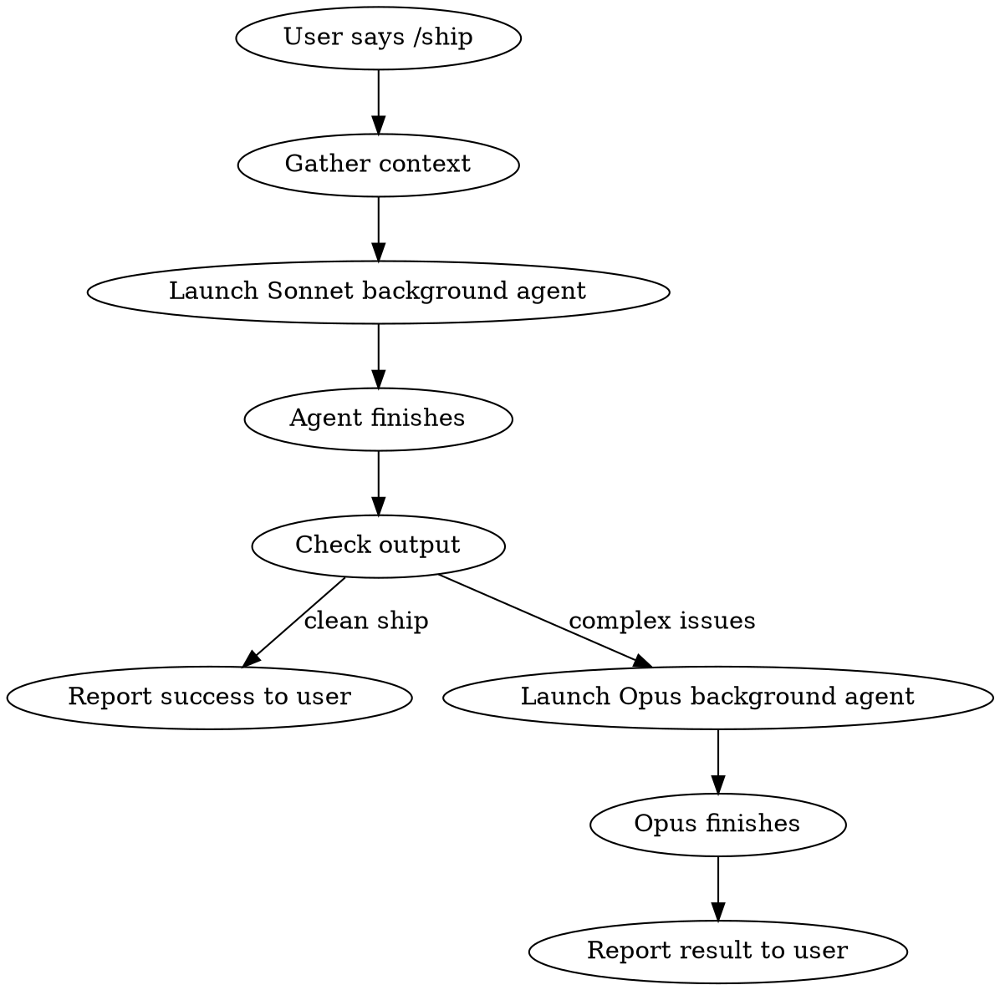

# Ship

Commit, push, and merge the current branch in one shot. **Always runs as a background subagent** so you can keep working.

## Dispatch Rules

**Always use the Task tool with `run_in_background: true`.**



### Step 1: Gather context (you do this, not the subagent)

Run these in parallel before dispatching:
```bash
git status
git branch --show-current
git log --oneline -5
gh pr view --json number,title,state,mergeable,mergeStateStatus,baseRefName 2>/dev/null
```

### Step 2: Dispatch Sonnet background agent

Use the Task tool:
- `subagent_type`: `"general-purpose"`
- `model`: `"sonnet"`
- `run_in_background`: `true`
- `description`: `"Ship current branch"`
- `prompt`: Include the gathered context and the full ship instructions below.

Tell the user: "Shipping in the background — I'll let you know when it's done."

### Step 3: Check the result

Read the background agent's output file when notified. If the agent reports any of these **complex issues**, escalate to Opus:

| Escalate to Opus when |
|----------------------|
| Merge conflicts that need code-level resolution |
| CI failures requiring code fixes |
| PR has review comments or requested changes |
| Rebase produces non-trivial conflicts |
| Any situation the Sonnet agent couldn't resolve |

To escalate: launch a new Task with `model: "opus"`, `run_in_background: true`, and include the Sonnet agent's output as context so Opus knows what was tried.

If the ship was clean, just report success to the user with the PR URL.

---

## Ship Instructions (include in subagent prompt)

The following is the full procedure the subagent must follow:

### 1. Commit (if needed)

If there are unstaged/untracked changes, stage and commit them with a good message. Follow the repo's commit style. End with `Co-Authored-By: Codex <noreply@anthropic.com>`.

### 2. Push

```bash
git push -u origin HEAD
```

### 3. PR (create if needed)

Check for existing PR. If none, create one:
```bash
gh pr create --title "..." --body "$(cat <<'EOF'
## Summary
...

## Test plan
...
EOF
)"
```

Keep the title under 70 chars. Base branch is `master` unless told otherwise.

### 4. Check merge readiness

```bash
gh pr checks
gh pr view --json mergeable,mergeStateStatus,baseRefName
```

**If behind base branch:**
```bash
git fetch origin
git rebase origin/master
git push --force-with-lease
```

**If merge conflicts or CI failures:** Attempt to resolve. If too complex, report back with details for Opus escalation.

### 5. Merge

```bash
gh pr merge --squash --delete-branch
```

Use `--squash` by default. Use `--rebase` if the branch has clean atomic commits worth preserving.

### 6. Clean up local

```bash
git checkout master
git pull
```

## Important

- **Always confirm before force-pushing.** Even `--force-with-lease` deserves a heads-up.
- **Never force-push to master/main.**
- If CI is failing on something unrelated to your changes, tell the user rather than trying to fix unrelated failures.
- If the PR has review comments or requested changes, stop and tell the user instead of merging.
- The subagent MUST output a clear status line at the end: either `SHIP_OK: <PR URL>` or `SHIP_BLOCKED: <reason>` so the dispatcher can parse the outcome.
