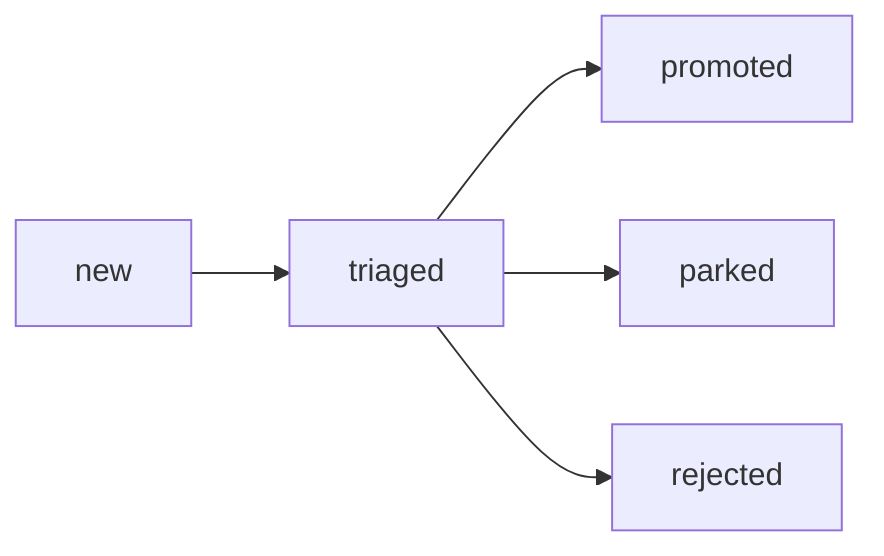
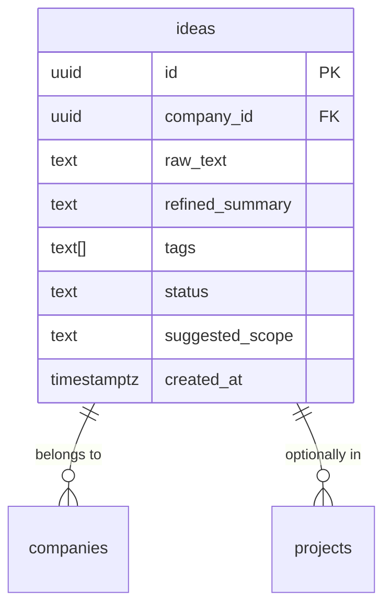
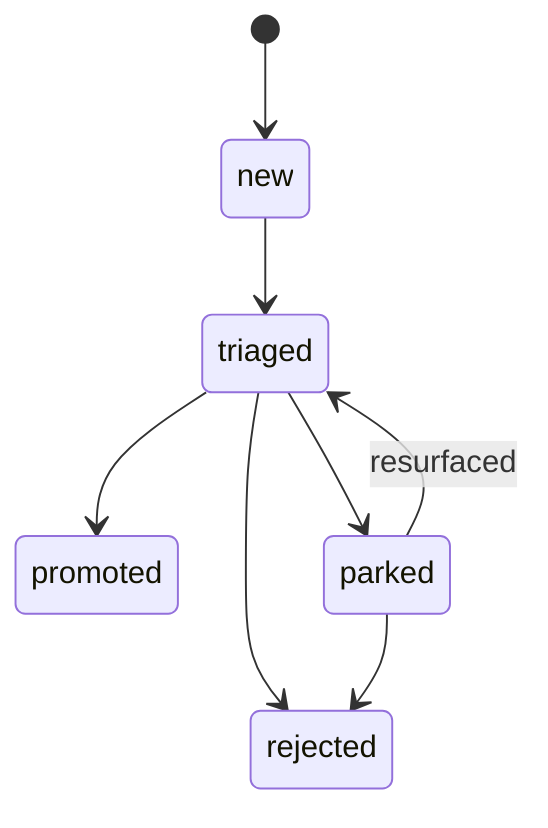

# Idea Visualiser: Interactive Proposal Reader with Approval Workflow

**Date:** 2026-02-25
**Status:** Proposal (initial design)
**Author:** CPO
**Related docs:** `2026-02-24-idea-to-job-pipeline-design.md` (pipeline reference), `2026-02-25-ideas-inbox-proposal.md` (example of a proposal that needs visualisation), `2026-02-25-cpo-pipeline-orchestration-proposal.md` (CPO pipeline ops), `2026-02-25-skills-distribution-proposal.md` (skill distribution), `idea-to-pitch-page` skill (existing pattern for markdown-to-web)


___
## Tom feedback
2026-02-25 I've changed from spec visualiser to idea visualiser. I think this could be used to review things at multiple stages, e.g. after /internal-proposal, after it's a design, after it's requirements, or even to understand fully what's been built. Can you redraft with that in mind?

---

## Problem Statement

The zazigv2 pipeline produces a high volume of structured markdown documents: proposals, specs, pipeline designs, architecture decisions, and implementation plans. These live in `/docs/plans/` and are consumed by Tom (and occasionally Chris Evans) in two ways:

1. **Terminal** -- reading raw markdown via `cat`, `less`, or Claude Code sessions
2. **Obsidian** -- reading rendered markdown in the Obsidian vault that mirrors the repo

Both channels share the same limitations:

**1. Walls of text.** A proposal like the Ideas Inbox spec is 600 lines of markdown. The CPO Pipeline Orchestration proposal is 800+. Reading a long document linearly is cognitively expensive. Important decisions are buried in section 7 of a 12-section document. Trade-off tables, schema designs, and flow diagrams compete for attention with explanatory prose.

**2. No visual representation of systems.** ASCII art diagrams in markdown (`+--> promoted --> feature/job/research`) communicate structure but not clarity. Schema designs are SQL CREATE TABLE statements that require mental parsing. Pipeline flows are nested bullet lists. State machines are text tables. These should be rendered as actual diagrams, database schemas, and flowcharts.

**3. No interactive approval mechanism.** Tom reads a proposal, forms an opinion, then tells the CPO "yes" or "no" verbally in the terminal. There is no persistent record of which sections were approved, which need discussion, or which decisions are still open. When a proposal has 9 open questions (like the Ideas Inbox), there is no way to track which have been resolved.

**4. Not shareable.** Sending a raw markdown file to Chris Evans means sending a file or a GitHub link. Neither is a good reading experience for someone who has not been following the project. There is no "here is the proposal, read it on your phone, tell me what you think" workflow.

**5. Bespoke or nothing.** The `idea-to-pitch-page` skill exists and produces stunning one-page pitch sites. But it generates a unique design per document -- custom CSS animations, bespoke layout, hand-selected colour palette. This works for investor pitches. It does not work for the daily flow of specs and proposals that need quick, consistent visualisation. The CPO should not be designing a website every time it finishes a proposal.

### The gap

What is missing is a **reusable, templated reader application** that takes any structured markdown proposal and renders it as an interactive visual page with built-in approval controls. Not a pitch page. A proposal reader. Fast to generate, consistent in appearance, private by default, with a write-back mechanism for decisions.

---

## Design Goals

1. **One template for all proposals.** The same UI renders an architecture proposal, a feature spec, a pipeline design, and an implementation plan. The template adapts to content structure, not content type.
2. **Zero manual design work.** The CPO finishes a spec, invokes a skill or script, and gets a deployed URL. No colour selection, no layout decisions, no CSS authoring.
3. **Interactive, not just visual.** Approval controls, comment fields, decision buttons on open questions. Not a static render -- a working tool.
4. **Private by default.** Deployed behind authentication. Not indexed by search engines. Shareable via URL with a gated access mechanism.
5. **Mobile-friendly.** Tom reviews proposals on his phone during walks. The layout must work at 375px width.
6. **Pipeline-integrated.** Approvals in the UI can flow back to the zazigv2 pipeline -- setting a feature to `ready_for_breakdown`, resolving open questions, or recording decisions for audit.

---

## Part 1: The Common UI Template

### Layout

```
+--------------------------------------------------+
|  [zazig logo]  Proposal Title       [status badge]|
+----------+---------------------------------------+
|          |                                        |
| SIDEBAR  |  MAIN CONTENT                          |
|          |                                        |
| ToC      |  Section heading                       |
| (sticky) |  Rendered prose                         |
|          |  [Diagram/flowchart]                    |
|          |  [Table (interactive)]                  |
|          |                                        |
|          |  --- Section break ---                  |
|          |                                        |
| Section  |  Next section                          |
| links    |  [Approval control]                     |
|          |                                        |
| -------- |                                        |
| DECISIONS|  ...                                    |
| PANEL    |                                        |
| (summary)|                                        |
+----------+---------------------------------------+
|  [Overall: Approve All | Request Changes | Defer] |
+--------------------------------------------------+
```

**On mobile (< 768px):** Sidebar collapses to a hamburger menu. Decisions panel moves to a floating bottom bar. Approval controls become inline buttons within each section.

### Design System

Inherit from the existing zazigv2 dashboard aesthetic. The org-model dashboard already uses:
- **Typography:** Space Mono (display) + Work Sans (body)
- **Palette:** Deep dark background (#0a0a14), electric cyan accent (#00d4ff), purple secondary (#7c3aed)
- **Components:** Cards with subtle borders, hover states, status badges with colour coding

The spec visualiser reuses this design system exactly. No new palette, no new fonts. Consistency with the existing dashboard means the tooling feels like part of the same product.

```css
:root {
  --bg-deep: #0a0a14;
  --bg: #0d0d1a;
  --bg-elevated: #12122a;
  --bg-card: #161633;
  --text: #e8ecf4;
  --text-secondary: #9ba4b8;
  --text-muted: #5a6278;
  --border: rgba(0, 212, 255, 0.12);
  --accent: #00d4ff;
  --accent-dim: rgba(0, 212, 255, 0.15);
  --purple: #7c3aed;
  --green: #22c55e;
  --amber: #f59e0b;
  --red: #ef4444;
  --font-display: 'Space Mono', monospace;
  --font-body: 'Work Sans', sans-serif;
}
```

### Content Rendering Rules

The template parses markdown structure and applies rendering upgrades. The rules are deterministic -- same input always produces same output.

| Markdown Pattern | Rendered As | Library |
|-----------------|-------------|---------|
| `# Heading 1` | Page title (extracted to header bar) | -- |
| `## Heading 2` | Section heading + ToC entry + anchor link | -- |
| `### Heading 3` | Subsection heading (indented in ToC) | -- |
| Regular paragraphs | Prose with Work Sans, 1.6 line height | -- |
| `**bold**` in heading context | Section badge / tag | -- |
| Fenced code blocks (` ```sql `) | Syntax-highlighted code with copy button | Shiki or Prism |
| Fenced code blocks (` ```mermaid `) | Rendered Mermaid diagram | Mermaid.js |
| ASCII art diagrams (` +--> `, box drawing) | Converted to Mermaid flowchart | Custom parser |
| Markdown tables | Interactive sortable tables with hover rows | -- |
| Checklists (`- [ ]`, `- [x]`) | Interactive checkboxes (approval-linked) | -- |
| `> blockquote` | Callout card with left accent border | -- |
| Horizontal rule (`---`) | Section divider with visual spacing | -- |
| `| Status | Meaning |` tables with status columns | Colour-coded status badges in cells | Custom renderer |
| Sections titled "Open Questions" | Extracted to decisions panel + given decision controls | Custom parser |
| Numbered sub-headings under "Open Questions" | Individual decision cards with approve/reject/defer buttons | Custom parser |
| `**Date:**`, `**Status:**`, `**Author:**` metadata | Extracted to header metadata bar | Custom parser |
| `**Related docs:**` | Rendered as linked pills in header | Custom parser |
| Lists with `|` separator (trade-off tables) | Comparison cards side by side | Custom renderer |

### ASCII-to-Diagram Conversion

The proposals are full of ASCII art:

```
                    +--> promoted (-> feature/job/research)
                    |
  new --> triaged --+--> parked
                    |
                    +--> rejected
```

The renderer detects ASCII art blocks (heuristic: lines containing `-->`, `+-`, `|`, box-drawing characters) and converts them to Mermaid flowcharts:



This conversion does not need to be perfect. A best-effort parse with a fallback to displaying the raw ASCII in a monospace code block is acceptable. The conversion can be assisted by an LLM at generation time (the skill can use Claude to interpret the ASCII and produce Mermaid syntax).

### Schema Rendering

SQL CREATE TABLE blocks are detected and rendered as visual database diagrams:

- Table name as header
- Columns listed with type, constraints, and descriptions
- Foreign keys rendered as relationship arrows to other tables
- Indexes shown as badges on relevant columns

This is a custom component that parses the SQL AST. Alternatively, tools like `dbdiagram.io` embed format or `mermaid erDiagram` can be used. The Mermaid ER diagram approach is simpler and does not require a third-party service:



### Typography and Spacing

- **Section headings (h2):** Space Mono, 24px, cyan accent underline, 48px top margin
- **Subsection headings (h3):** Space Mono, 18px, 32px top margin
- **Body text:** Work Sans, 16px, #e8ecf4, 1.65 line height, max-width 720px
- **Code blocks:** JetBrains Mono, 14px, #161633 background, 16px padding, rounded corners
- **Tables:** Full-width within content area, alternating row backgrounds, sticky headers
- **Blockquotes/callouts:** Left border 3px cyan, #12122a background, 16px padding

---

## Part 2: Approval Workflow

### Control Types

Three levels of approval controls, placed contextually within the rendered document:

#### 1. Section-Level Approval

Every h2 section gets an approval control strip at its bottom:

```
+-----------------------------------------------------------+
|  Section: Schema Design                                    |
|  [Approve] [Needs Discussion] [Comment...]                 |
+-----------------------------------------------------------+
```

- **Approve:** Green check. This section is accepted as-is.
- **Needs Discussion:** Amber flag. This section requires conversation before approval.
- **Comment:** Opens a text input for inline feedback.

#### 2. Decision Point Controls

Sections titled "Open Questions" (or containing numbered questions) get explicit decision controls:

```
+-----------------------------------------------------------+
|  Question 1: Deduplication                                 |
|                                                            |
|  Should the system detect duplicate ideas?                 |
|  Recommendation: manual in v1.                             |
|                                                            |
|  [Accept Recommendation] [Override...] [Defer]             |
+-----------------------------------------------------------+
```

- **Accept Recommendation:** Accepts the author's suggested answer.
- **Override:** Opens a text input for an alternative decision.
- **Defer:** Marks this question as "to be decided later."

#### 3. Overall Proposal Approval

A sticky bottom bar (or footer section) with the aggregate view:

```
+-----------------------------------------------------------+
|  12 sections: 8 approved, 2 need discussion, 2 not reviewed|
|  9 decisions: 6 accepted, 1 overridden, 2 deferred        |
|                                                            |
|  [Approve Proposal] [Request Changes] [Defer All]         |
+-----------------------------------------------------------+
```

The "Approve Proposal" button is only enabled when all sections have been reviewed (approved or flagged) and all decisions have been made (accepted, overridden, or deferred).

### Data Model

Approval data is stored per-proposal, per-reviewer.

```typescript
interface ProposalApproval {
  proposal_id: string;          // derived from filename or UUID
  proposal_path: string;        // e.g. "docs/plans/2026-02-25-ideas-inbox-proposal.md"
  reviewer: string;             // "tom", "chris", etc.
  created_at: string;           // ISO timestamp
  updated_at: string;
  overall_status: "pending" | "approved" | "changes_requested" | "deferred";

  sections: SectionApproval[];
  decisions: DecisionApproval[];
}

interface SectionApproval {
  section_id: string;           // slug of the h2 heading
  section_title: string;
  status: "not_reviewed" | "approved" | "needs_discussion";
  comment: string | null;
  updated_at: string;
}

interface DecisionApproval {
  decision_id: string;          // "open-question-1", "open-question-2", etc.
  question: string;             // the question text
  recommendation: string;       // the author's recommendation
  status: "pending" | "accepted" | "overridden" | "deferred";
  override_text: string | null; // if overridden, the alternative decision
  updated_at: string;
}
```

### Write-Back Options

Where do approvals persist? Four options evaluated:

| Option | Pros | Cons | Fit |
|--------|------|------|-----|
| **Supabase table** | Fits existing infra. Queryable. RLS. Can trigger events. | Requires new table + edge function. Overhead for what may be low volume. | Best for pipeline integration |
| **JSON file in repo** | Git-tracked. No infrastructure. Can be committed alongside the proposal. | Requires git push. Not real-time. Merge conflicts possible. | Best for audit trail |
| **Local Storage (browser)** | Zero infrastructure. Instant. | Lost when clearing browser. Not shareable. Not persistent. | Insufficient |
| **Supabase + JSON export** | Best of both. Real-time writes to Supabase. Periodic JSON export to repo for audit. | Most complex. | Ideal but overkill for v1 |

**Recommendation: Supabase table (v1), with JSON export as a v2 enhancement.**

Rationale: The approval data needs to be accessible to the pipeline. When Tom approves a proposal in the UI, the CPO needs to know. Supabase is the existing data layer, and the approval status can be queried by the CPO's MCP tools. A new `proposal_approvals` table is lightweight.

### Supabase Schema

```sql
CREATE TABLE public.proposal_approvals (
    id              uuid        PRIMARY KEY DEFAULT gen_random_uuid(),
    company_id      uuid        NOT NULL REFERENCES public.companies(id) ON DELETE CASCADE,

    -- Proposal identity
    proposal_path   text        NOT NULL,  -- relative to repo root, e.g. "docs/plans/2026-02-25-..."
    proposal_title  text        NOT NULL,

    -- Reviewer
    reviewer        text        NOT NULL,  -- "tom", "chris", etc.

    -- Overall status
    overall_status  text        NOT NULL DEFAULT 'pending'
                                CHECK (overall_status IN ('pending', 'approved', 'changes_requested', 'deferred')),

    -- Structured approval data (JSONB for flexibility)
    sections        jsonb       NOT NULL DEFAULT '[]'::jsonb,
    decisions       jsonb       NOT NULL DEFAULT '[]'::jsonb,
    comments        jsonb       NOT NULL DEFAULT '[]'::jsonb,

    -- Pipeline integration
    linked_feature_id uuid      REFERENCES public.features(id) ON DELETE SET NULL,
    linked_idea_id    uuid,     -- soft ref to ideas table

    -- Timestamps
    created_at      timestamptz NOT NULL DEFAULT now(),
    updated_at      timestamptz NOT NULL DEFAULT now()
);

CREATE TRIGGER proposal_approvals_updated_at
    BEFORE UPDATE ON public.proposal_approvals
    FOR EACH ROW
    EXECUTE FUNCTION update_updated_at_column();

-- Indexes
CREATE INDEX idx_proposal_approvals_company ON proposal_approvals(company_id);
CREATE INDEX idx_proposal_approvals_path ON proposal_approvals(proposal_path);
CREATE INDEX idx_proposal_approvals_status ON proposal_approvals(overall_status);

-- RLS
ALTER TABLE public.proposal_approvals ENABLE ROW LEVEL SECURITY;

CREATE POLICY "service_role_full_access" ON public.proposal_approvals
    FOR ALL TO service_role USING (true) WITH CHECK (true);
```

### Pipeline Integration via Approvals

When Tom clicks "Approve Proposal" in the UI:

1. The UI writes the approval to the `proposal_approvals` table via an edge function
2. If `linked_feature_id` is set, the edge function also updates the feature's status (e.g., to `ready_for_breakdown`)
3. If `linked_idea_id` is set, the idea's status is updated to `promoted`
4. An event is written to the events table: `proposal_approved`
5. The orchestrator picks up the event and can notify the CPO or trigger downstream pipeline stages

This closes the loop: the CPO writes a spec, generates a visual page, Tom approves it in the browser, and the pipeline advances -- without anyone typing "yes" in a terminal.

---

## Part 3: Private Hosting

### Options Compared

| Option | Cost | Setup Complexity | Auth Mechanism | Deploy Speed | Mobile Support | Verdict |
|--------|------|-----------------|---------------|-------------|---------------|---------|
| **Netlify + Basic Auth (_headers)** | Free (all plans) | Trivial | HTTP Basic Auth via _headers file | ~30s (CLI deploy) | Yes | **Recommended for v1** |
| **Netlify + Password Protection** | Pro plan ($19/mo) | Trivial | Dashboard-managed password | ~30s | Yes | Good but costs money |
| **Vercel + Middleware Auth** | Free (all plans) | Low | Next.js middleware basic auth | ~30s | Yes | Good if already on Vercel |
| **Vercel + Password Protection** | Enterprise or Pro+addon ($150) | Trivial | Vercel-managed | ~30s | Yes | Too expensive for this use case |
| **Cloudflare Pages + Access** | Free (50 users) | Medium | Zero Trust email challenge | ~30s | Yes | Overengineered for 2 users |
| **GitHub Pages (private repo)** | Free | Low | GitHub login (org members only) | ~60s (Actions) | Yes | Only works for GitHub org members |
| **Self-hosted (Supabase edge)** | Free (existing infra) | High | Custom auth | Instant (dynamic) | Yes | Only viable for Option B (dynamic renderer) |

### Recommendation: Netlify with Basic Auth (v1)

**Why Netlify:**

1. **The `idea-to-pitch-page` skill already deploys to Netlify.** The pattern is proven: `netlify deploy --create-site <name> --dir . --prod`. Tom has Netlify CLI configured.

2. **Basic Auth via `_headers` is free on all plans.** No Pro subscription needed. A `_headers` file in the deploy directory protects the entire site:

```
/*
  Basic-Auth: tom:password123 chris:password456
```

3. **Deploy speed is ~30 seconds.** From markdown to live URL in under a minute. Fast enough for the CPO to deploy as part of its proposal workflow.

4. **Not indexed.** Netlify sites with basic auth are not crawled by search engines. Adding `X-Robots-Tag: noindex` in the `_headers` file provides a belt-and-suspenders approach.

5. **Shareable via URL.** Tom sends Chris the URL + password. Simple. No account creation, no OAuth flow.

**Security note:** Basic Auth credentials are stored in plaintext in the `_headers` file, which lives in the deployed static assets. This is acceptable because: (a) the proposals are internal product docs, not secrets; (b) the password prevents casual access and search indexing, not targeted attacks; (c) upgrading to Netlify Pro password protection is a one-line change if stronger auth is needed later.

### Future: Cloudflare Pages + Access (v2)

If the number of proposals grows or Chris is replaced by a team, Cloudflare Pages with Zero Trust Access is the natural upgrade. The free tier supports 50 users, email-based authentication is zero-config, and Cloudflare's edge network provides fast global access. But for two reviewers sharing a password, this is over-engineering.

---

## Part 4: Generation Pipeline

### Option Analysis

| Approach | Description | Pros | Cons |
|----------|-------------|------|------|
| **A: Static build step** | Skill reads markdown, applies template, outputs static HTML, deploys | Simple. No runtime infra. Fast loads. Cacheable. | Must rebuild on every change. Each proposal is a separate deploy. |
| **B: Dynamic renderer** | A single deployed app fetches markdown from repo and renders on-the-fly | One deployment serves all proposals. Always current. | Needs a running server. Slower loads. More infrastructure. |
| **C: Hybrid** | Static generator for the rendered pages + dynamic API for approval writes | Best of both. Fast reads, interactive writes. | Two pieces to maintain. |

**Recommendation: Option C (Hybrid) -- static pages with a dynamic approval API.**

Rationale:

- **Static for reading.** Proposals are read 10x more than they are written. Static HTML loads instantly, works offline, and costs nothing to host. The markdown content does not change after generation.
- **Dynamic for writing.** Approval data needs to be written in real-time to Supabase. This is a thin API -- a single Supabase edge function that accepts approval writes. The static page makes `fetch()` calls to this endpoint.
- **Each proposal gets its own deploy.** This is intentional. A proposal URL (`spec-vis-ideas-inbox.netlify.app`) is permanent. Even after the repo moves on, the approved-with-annotations version remains accessible for audit.

### Generation Flow

```
CPO finishes a proposal
    |
    v
CPO invokes /visualise-spec skill (or pipeline script runs automatically)
    |
    v
Skill reads the markdown file from docs/plans/
    |
    v
Parser extracts structure:
  - Metadata (title, date, author, status, related docs)
  - Sections (h2 headings -> ToC entries)
  - Code blocks (SQL, TypeScript, mermaid, ASCII art)
  - Tables (markdown tables -> structured data)
  - Open questions (numbered items in "Open Questions" section)
  - Checklists
    |
    v
Template engine renders HTML:
  - Injects parsed content into the common layout
  - Converts ASCII art to Mermaid (LLM-assisted)
  - Syntax-highlights code blocks
  - Renders tables as interactive components
  - Generates approval controls for sections and decisions
  - Embeds Supabase client for approval writes
    |
    v
Outputs to a temp directory:
  index.html     -- the rendered page
  _headers       -- Basic Auth configuration
    |
    v
Deploys via Netlify CLI:
  netlify deploy --create-site zazig-spec-{slug} --dir ./output --prod
    |
    v
Returns the URL to the CPO
    |
    v
CPO notifies Tom: "Your proposal is ready for review: https://zazig-spec-ideas-inbox.netlify.app"
```

### The `/visualise-spec` Skill

A new Claude Code skill that automates the generation flow. Design:

```yaml
---
name: visualise-spec
description: Transform a markdown proposal into an interactive visual page with approval controls. Use when a proposal or spec needs to be deployed for review. Invoke after finishing a spec or when the human asks to "visualise" or "deploy" a proposal.
---
```

The skill:
1. Reads the target markdown file
2. Parses its structure (using the rendering rules from Part 1)
3. Uses Claude to convert ASCII diagrams to Mermaid syntax (the LLM is already available in the skill context)
4. Generates a single `index.html` file using the template
5. Writes a `_headers` file with Basic Auth credentials (from environment variable or Doppler)
6. Deploys to Netlify
7. Returns the URL

**Output:** A single self-contained HTML file. No build system, no bundler, no node_modules. Following the `idea-to-pitch-page` pattern: one HTML file with inlined CSS and JavaScript. This keeps generation simple and deployment instant.

### Why a single HTML file (not a React app)

The `idea-to-pitch-page` skill proves this pattern works. A single HTML file with inlined styles and scripts:
- Deploys in 3 seconds (no build step)
- Has zero dependencies at deploy time
- Can be generated entirely by the LLM (no template compilation)
- Is self-contained for archiving

The interactive elements (approval buttons, comment forms, Mermaid rendering, table sorting) are implemented with vanilla JavaScript or lightweight libraries loaded from CDN:
- **Mermaid.js** (~1.2MB, loaded from CDN, renders diagrams client-side)
- **Shiki** or **Prism** (syntax highlighting, CDN)
- **Supabase JS client** (~50KB, CDN, for approval writes)

No React, no build pipeline, no node_modules. The page is a document, not an application.

---

## Part 5: Integration with the zazigv2 Pipeline

### Trigger Points

| Event | What Happens | Who Triggers |
|-------|-------------|-------------|
| CPO finishes a proposal (manual) | CPO invokes `/visualise-spec`, deploys, notifies human | CPO |
| Feature set to `ready_for_breakdown` | Spec could auto-generate a visual page for audit | Pipeline automation (future) |
| Human approves proposal in UI | Approval written to Supabase, feature status updated | Human (via browser) |
| Human requests changes in UI | Comments written to Supabase, CPO notified | Human (via browser) |
| CPO receives "changes requested" notification | CPO reads the comments, revises the spec, re-generates | CPO |

### MCP Tools

Two new tools for the CPO to interact with the approval system:

#### `query_proposal_approvals`

```typescript
server.tool(
  "query_proposal_approvals",
  "Check the approval status of a proposal, including section-level and decision-level approvals.",
  {
    proposal_path: z.string().optional().describe("Proposal file path (relative to repo root)"),
    overall_status: z.string().optional().describe("Filter by status: pending, approved, changes_requested, deferred"),
  },
  async ({ proposal_path, overall_status }) => {
    // Query proposal_approvals table
    // Return: approval status, section statuses, decision statuses, comments
  },
);
```

#### `link_proposal_to_feature`

```typescript
server.tool(
  "link_proposal_to_feature",
  "Link a proposal approval record to a feature, so approving the proposal can advance the feature's pipeline status.",
  {
    proposal_path: z.string().describe("Proposal file path"),
    feature_id: z.string().describe("Feature UUID to link"),
  },
  async ({ proposal_path, feature_id }) => {
    // Update proposal_approvals.linked_feature_id
    // Return: confirmation
  },
);
```

### Notification Flow

When Tom approves a proposal in the browser:

1. Browser calls `approve-proposal` edge function
2. Edge function writes to `proposal_approvals`
3. Edge function writes an event: `{ type: 'proposal_approved', detail: { proposal_path, reviewer, linked_feature_id } }`
4. If `linked_feature_id` is set, edge function updates feature status
5. Orchestrator reads the event and sends a notification to the CPO
6. CPO: "Tom approved the Ideas Inbox proposal. The linked feature has been moved to ready_for_breakdown."

### Integration with the Ideas Inbox

When a proposal originates from an idea in the inbox:
- The proposal approval record has `linked_idea_id` set
- When the proposal is approved, the idea's status can be updated to `promoted`
- The full traceability chain: idea -> proposal -> approval -> feature -> jobs

---

## Part 6: Tech Stack Recommendation

### For the Template (rendered page)

| Component | Technology | Why |
|-----------|-----------|-----|
| Layout and styles | Vanilla HTML + CSS (inlined) | Same pattern as idea-to-pitch-page. No build step. |
| Typography | Space Mono + Work Sans (Google Fonts) | Matches existing zazigv2 dashboard |
| Diagrams | Mermaid.js (CDN) | Best-in-class markdown diagram rendering. Supports flowcharts, ER diagrams, state diagrams, sequence diagrams. |
| Syntax highlighting | Prism.js (CDN) | Lighter than Shiki for client-side use. Supports SQL, TypeScript, markdown. |
| Table interactivity | Vanilla JS | Sorting, filtering, hover states. No library needed for basic interactivity. |
| Approval writes | Supabase JS client (CDN) | Direct writes to the proposal_approvals table via anon key + RLS. |
| Approval UI | Vanilla JS + CSS | Buttons, text inputs, status badges. No framework needed for this level of interactivity. |

### For the Generation Pipeline

| Component | Technology | Why |
|-----------|-----------|-----|
| Markdown parsing | The LLM itself (Claude) | The `/visualise-spec` skill uses Claude to parse the markdown structure and generate HTML. No programmatic markdown parser needed -- the LLM understands markdown natively. |
| ASCII-to-Mermaid conversion | Claude (in-skill) | The LLM reads ASCII art and produces Mermaid syntax as part of the generation. |
| Template rendering | Claude (in-skill) | The LLM generates the complete HTML file from the template pattern + parsed content. Same approach as idea-to-pitch-page. |
| Deployment | Netlify CLI | `netlify deploy --create-site --dir . --prod` |
| Auth credentials | Doppler (existing secret management) | Basic Auth password stored in Doppler, injected by the skill. |

### For the Approval API

| Component | Technology | Why |
|-----------|-----------|-----|
| Database | Supabase (existing) | One new table. Follows existing patterns. |
| API | Supabase edge function | One new function: `approve-proposal`. Accepts section/decision approvals, writes to table. |
| Events | Existing events table | New event type: `proposal_approved`. |
| Client | Supabase JS (@supabase/supabase-js, CDN) | The rendered HTML page includes the Supabase client and makes direct API calls. |

### What about React, Next.js, Astro, MDX?

Evaluated and rejected for v1:

- **React/Next.js:** Overkill. The page is a document reader with some buttons, not an application. Adding React means a build step, a package.json, node_modules, and deployment complexity. The existing dashboard uses plain HTML and works fine.
- **Astro:** Attractive for content-heavy sites. But Astro requires a build step and project structure. The single-file HTML approach is simpler for per-proposal deploys.
- **MDX:** Interesting for mixing React components into markdown. But MDX requires a build pipeline and the markdown-to-MDX conversion adds complexity. The LLM can generate the HTML directly.
- **Docusaurus/GitBook:** These are documentation sites, not proposal readers. They serve a different purpose (versioned docs with navigation) and do not support approval workflows.
- **Markdoc:** Stripe's markdown extension. Good for structured documentation with custom components. But it requires a build pipeline and is designed for documentation sites, not one-off proposal pages.

**The key insight:** The `idea-to-pitch-page` skill already demonstrates that Claude can generate a complete, beautiful, interactive single-page HTML file. No build tools. No framework. The template system is the LLM itself, guided by a well-specified skill prompt. This approach has zero infrastructure cost and produces results in seconds.

If the spec visualiser grows into a full documentation platform (many proposals, search, cross-linking), the tech stack decision should be revisited. But for v1 -- "render one proposal as a visual page with approval controls" -- a single HTML file is the right level of complexity.

---

## Part 7: Example -- Ideas Inbox Proposal in the Spec Visualiser

To make this concrete, here is how the Ideas Inbox proposal (`2026-02-25-ideas-inbox-proposal.md`) would render in the spec visualiser.

### Header Bar

```
+-----------------------------------------------------------------+
|  zazig   Ideas Inbox: Pre-Pipeline Capture and Triage           |
|          Date: 2026-02-25  Author: CPO  Status: Proposal        |
|          Related: idea-to-job-pipeline | software-dev-pipeline   |
+-----------------------------------------------------------------+
```

### Sidebar (Table of Contents)

```
Problem Statement          [not reviewed]
Design Goals               [approved]
Schema Design              [approved]
Lifecycle                  [approved]
Promotion Mechanics        [needs discussion]
MCP Tools                  [approved]
Edge Functions             [approved]
Integration                [approved]
Comparison                 [not reviewed]
CPO Role Prompt Changes    [approved]
Events Integration         [approved]
Migration Plan             [approved]
Implementation Sequence    [approved]
Open Questions (7)         [3 decided, 4 pending]
```

### Rendered Content (Schema Design section)

Instead of raw SQL, the schema section would show:

1. **An ER diagram** (Mermaid) showing the `ideas` table and its relationships to `companies` and `projects`
2. **A visual table layout** showing each column with its type, constraints, and description pulled from the design rationale section
3. **The raw SQL** in a collapsible code block (for engineers who want to see it)
4. **An approval control** at the bottom: `[Approve] [Needs Discussion] [Comment...]`

### Rendered Content (Lifecycle section)

Instead of the ASCII state diagram:

```
                    +--> promoted
                    |
  new --> triaged --+--> parked
                    |
                    +--> rejected
```

The visualiser would render a proper Mermaid state diagram:



Interactive: clicking a state highlights the row in the "Detailed states" table below.

### Rendered Content (Open Questions section)

Each of the 7 open questions becomes a decision card:

```
+-----------------------------------------------------------+
|  Q1: Deduplication                                 [PENDING]|
|                                                            |
|  Should the system detect duplicate ideas?                 |
|                                                            |
|  CPO Recommendation: Manual in v1. Expected volume         |
|  (tens of ideas/week) does not justify automated dedup.    |
|                                                            |
|  [Accept Recommendation] [Override...] [Defer]             |
+-----------------------------------------------------------+

+-----------------------------------------------------------+
|  Q2: Idea Comments/Thread                        [ACCEPTED]|
|                                                            |
|  Should ideas support a comment thread?                    |
|                                                            |
|  CPO Recommendation: No thread in v1.                      |
|  Tom's Decision: Accepted                                  |
|                                                            |
|  [Accepted] [Change Decision]                              |
+-----------------------------------------------------------+
```

### Decisions Panel (Sidebar, Below ToC)

```
DECISIONS SUMMARY
-----------------
7 questions total
3 accepted (Q2, Q4, Q5)
0 overridden
1 deferred (Q3)
3 pending (Q1, Q6, Q7)

Overall: Not ready for approval
  (3 decisions still pending)
```

### Footer

```
+-----------------------------------------------------------+
|  12 sections: 9 approved, 1 needs discussion, 2 pending   |
|  7 decisions: 3 accepted, 1 deferred, 3 pending           |
|                                                            |
|  [Approve Proposal] (disabled)  [Request Changes]  [Defer]|
+-----------------------------------------------------------+
```

---

## Part 8: Implementation Plan

### Phase 1: Template and Generation (1-2 days)

**Goal:** Generate a visual page from any markdown proposal and deploy it to Netlify.

**Deliverables:**
1. The `/visualise-spec` skill prompt (SKILL.md)
2. A reference template that the skill uses as its generation guide (similar to how `idea-to-pitch-page` has its template structure in the SKILL.md)
3. Deploy and test with one real proposal (the Ideas Inbox spec)

**What this does NOT include:** Approval workflow, Supabase integration, pipeline integration. Phase 1 is read-only -- a beautiful render of the markdown with diagrams and good typography.

**Dependencies:** None. Uses existing Netlify CLI and skill infrastructure.

**Complexity:** Medium. The skill prompt needs careful design to produce consistent, high-quality output. The ASCII-to-Mermaid conversion logic needs iteration. But the fundamental pattern (LLM generates HTML) is proven by `idea-to-pitch-page`.

### Phase 2: Approval Controls (1-2 days)

**Goal:** Add interactive approval controls to the generated pages.

**Deliverables:**
1. Supabase migration: `proposal_approvals` table
2. Supabase edge function: `approve-proposal` (accepts approval writes)
3. Updated template with approval controls (section-level, decision-level, overall)
4. Supabase JS client integration in the generated HTML

**Dependencies:** Phase 1 (the template must exist before adding controls to it).

**Complexity:** Medium. The Supabase table and edge function are straightforward (same patterns as existing features/jobs tables). The client-side JavaScript for approval controls is moderate complexity.

### Phase 3: Pipeline Integration (1 day)

**Goal:** Connect approvals to the pipeline so that approving a proposal can advance features.

**Deliverables:**
1. `proposal_approved` event type in the events table
2. Feature status update logic in the `approve-proposal` edge function
3. MCP tools: `query_proposal_approvals`, `link_proposal_to_feature`
4. Notification flow: approval event -> orchestrator -> CPO notification

**Dependencies:** Phase 2 (approval data must exist before it can trigger pipeline actions).

**Complexity:** Simple. All infrastructure exists. This is wiring.

### Phase 4: Automation and Polish (1 day)

**Goal:** Make the flow automatic and robust.

**Deliverables:**
1. Auto-generation: CPO automatically deploys a visual page after finishing any spec (skill instruction update)
2. Mobile optimisation pass on the template
3. Netlify site naming convention: `zazig-spec-{date}-{slug}` for consistent URLs
4. Credential management: Basic Auth password from Doppler, not hardcoded
5. Index page: a listing of all deployed spec pages (optional)

**Dependencies:** Phases 1-3.

**Complexity:** Simple. Polish and automation, not new capability.

### Total Estimated Effort

**5-7 jobs across 4 phases.** Can be parallelised:
- Phase 1 (template + skill) and Phase 2 (Supabase migration + edge function) can run in parallel
- Phase 3 depends on Phase 2
- Phase 4 depends on Phases 1-3

Realistic timeline: 3-4 days of pipeline execution if jobs are dispatched efficiently.

---

## Part 9: Open Questions

### 1. Per-proposal deploys vs single deployment

Should each proposal get its own Netlify site (as designed), or should there be a single site that serves all proposals?

**Current design:** Per-proposal deploys. Each spec gets its own URL and its own Netlify site. This mirrors the `idea-to-pitch-page` pattern.

**Alternative:** A single Netlify site (`zazig-specs.netlify.app`) with multiple pages (`/ideas-inbox`, `/skills-distribution`, etc.). This requires a build step that aggregates all proposals, but provides a single URL for "all proposals" and avoids Netlify site sprawl.

**Trade-off:** Per-proposal is simpler to generate (no build aggregation) but creates many Netlify sites. Single-site is cleaner operationally but requires a static site generator or dynamic routing.

**Recommendation:** Per-proposal for v1. Revisit if site count exceeds ~20.

### 2. Reviewer authentication

Basic Auth protects the site from public access. But it does not identify the reviewer -- Tom and Chris share the same password. For the approval workflow to record "who approved what," the reviewer must self-identify.

**Options:**
- **Self-identification:** A "Who are you?" dropdown when first loading the page (Tom, Chris). Simple but not secure -- anyone with the password could claim to be Tom.
- **Separate passwords per user:** Different Basic Auth credentials per reviewer. The edge function maps the credential to a reviewer name.
- **Supabase Auth:** The page uses Supabase Auth to log in with email/password. More secure but adds friction.

**Recommendation:** Self-identification for v1 (a simple name selector stored in localStorage). The audience is 2 trusted people. If the team grows, upgrade to Supabase Auth.

### 3. Re-generation on proposal update

If the CPO revises a proposal after Tom requests changes, should the visual page be re-generated and redeployed to the same URL?

**Options:**
- **Redeploy to same site:** Same URL, updated content. Approval state preserved (in Supabase, keyed by proposal_path, not by deploy).
- **New deploy:** New URL, fresh approval state. Old version preserved for comparison.
- **Versioned:** Same site, but with version indicator ("v1 approved, v2 pending review").

**Recommendation:** Redeploy to the same Netlify site (overwrite). Approval state persists in Supabase because it is keyed by `proposal_path`, not by the deploy. Previous review comments remain visible. A "revision history" is a v2 feature.

### 4. Should the CPO always auto-deploy?

Should every proposal the CPO writes automatically get a visual page? Or should it be opt-in?

**Options:**
- **Always deploy:** Every file written to `docs/plans/` gets a visual page. Maximum coverage but potentially noisy.
- **Opt-in:** CPO or human explicitly invokes `/visualise-spec`. Selective but requires an extra step.
- **Threshold:** Auto-deploy for documents over N lines or containing open questions. Heuristic-based.

**Recommendation:** Opt-in for v1. The CPO offers to deploy after finishing a spec: "Want me to deploy this as a visual page for review?" The human can say yes or no. Auto-deploy is a trust level upgrade (similar to the inbox promotion trust levels).

### 5. Offline capability

If Tom is reviewing a proposal on his phone during a walk (no reliable connectivity), should the page work offline?

**Options:**
- **No offline:** The page requires connectivity for Supabase writes. Tom can read offline (the HTML is loaded) but cannot approve.
- **Service Worker:** Cache the page for offline reading. Queue approval writes for when connectivity returns.
- **Progressive Web App:** Full PWA with offline support, push notifications for new proposals.

**Recommendation:** No offline for v1. The read experience works offline naturally (the HTML is a static file). Approval writes require connectivity. Service Worker is a v2 enhancement.

### 6. Existing dashboard relationship

The zazigv2 repo already has a `dashboard/` directory with the pipeline dashboard and the org-model reference pages. Should the spec visualiser live here, or is it a separate concern?

**Options:**
- **Part of the dashboard:** Add a "Proposals" section to the existing dashboard. Shared design system, shared navigation.
- **Separate deployment:** Each proposal is its own site. No relationship to the dashboard beyond shared design tokens.
- **Dashboard as index:** The dashboard links to proposal pages but does not host them.

**Recommendation:** Separate deployment for v1 (per-proposal Netlify sites). The dashboard can link to proposal pages. If a "proposals index" becomes valuable, it can be a section of the dashboard that lists all deployed specs with their approval status.

### 7. Diagram editing

Should the rendered diagrams be editable? Mermaid.js supports live editing. Tom might want to tweak a flowchart while reviewing.

**Recommendation:** Read-only in v1. Diagram edits should flow back through the markdown source (edit the proposal, re-generate). Live diagram editing is a collaboration feature that adds significant complexity.

---

## What This Does NOT Cover

- **Versioned documentation.** This is not a documentation site. It is a proposal reader. There is no versioning, search across proposals, or cross-linking (beyond related docs in the header). If zazigv2 needs a documentation site, that is a separate product (Docusaurus, Astro Starlight, or similar).
- **Real-time collaboration.** Two reviewers cannot see each other's approvals in real-time. Each reviewer works independently. Conflict resolution (Tom approves, Chris rejects) is not handled -- the audience is small enough that verbal coordination suffices.
- **Template customisation.** The template is fixed. Proposals do not get custom colours, layouts, or branding. This is a feature, not a limitation -- consistency is the goal.
- **Non-proposal content.** This system is designed for structured markdown proposals from `docs/plans/`. It is not a general-purpose markdown renderer. READMEs, changelogs, and other markdown files are out of scope.
- **Analytics.** No tracking of who viewed what, how long they spent, or which sections they scrolled past. This is an internal review tool, not a product page.

---

## Summary

The Spec Visualiser is a reusable template system that transforms structured markdown proposals into interactive visual pages with built-in approval controls. It follows the proven `idea-to-pitch-page` pattern (LLM generates a single HTML file, deployed to Netlify) but replaces the bespoke design approach with a consistent, templated UI that matches the existing zazigv2 dashboard aesthetic.

The system has three layers:

1. **Read layer:** Markdown parsed and rendered with good typography, Mermaid diagrams, syntax-highlighted code, interactive tables, and collapsible sections. Generated by a Claude Code skill (`/visualise-spec`).

2. **Write layer:** Section-level and decision-level approval controls that write to a Supabase `proposal_approvals` table. Reviewers can approve, flag for discussion, or defer each section and open question independently.

3. **Integration layer:** Approvals flow back to the pipeline via events. Approving a proposal can advance a linked feature to `ready_for_breakdown`. The CPO receives notifications and can query approval status via MCP tools.

The implementation is four phases over 5-7 jobs. Phase 1 (template + skill) delivers immediate value: any proposal can be converted to a visual page in under a minute. Phases 2-4 add the approval workflow, pipeline integration, and automation.

No new frameworks. No new build systems. One HTML file, one Supabase table, one edge function, one skill prompt. The complexity budget is minimal because the hard work -- understanding markdown structure and generating beautiful HTML -- is done by the LLM at generation time.

---

## Addendum: User Feedback (2026-02-25, post-proposal)

Tom provided additional requirements after reviewing the initial proposal. These should be incorporated in the next revision.

### A1. Shareable link as the primary output

The key UX: when a spec is done, the CPO (or the pipeline) produces a URL. That URL gets sent via Slack, embedded in terminal notifications, shown in the web dashboard — anywhere. The user clicks it on their phone, laptop, or wherever they are, and they can read and approve. The link IS the approval workflow.

### A2. Deep linking back to the CPO

Approve/reject is not enough. When a user doesn't like something, they need to dig back in with the CPO around that specific section. Design requirements:

- **Per-section comment/discuss controls** — not just thumbs up/down but "I have thoughts on this"
- **Deep link to CPO session** — clicking "discuss" on a section should generate a contextualised message to the CPO: "Tom wants to discuss Section 5 (Schema Design) of the Ideas Inbox proposal. His comment: [text]"
- **Recontextualisation** — the CPO receives the comment with enough context to pick up the conversation without re-reading the entire proposal. The deep link should include: proposal title, section name, section content snippet, user's comment.
- **Channel options** — the "discuss" action could route through: Slack message to CPO channel, tmux injection into CPO session (existing notification path), or a new Telegram thread. The routing depends on where the user is.

This turns the spec visualiser from a read-only approval tool into a **two-way communication surface** between human and CPO. The CPO gets structured feedback on specific sections rather than a blanket "looks good" or "change this."

### A3. Auto-regeneration on spec update

Rather than manually invoking `/visualise-spec` each time, the page should auto-regenerate when the underlying markdown changes. Options:

1. **Git hook / CI trigger** — when a file in `docs/plans/` is committed, auto-regenerate its visual page and redeploy. Simple, event-driven, no polling.
2. **File watcher in daemon** — the zazig daemon watches `docs/plans/` and triggers regeneration on change. Lower latency than CI.
3. **Always-on comparison** — the deployed page periodically checks whether its source markdown has changed (hash comparison) and shows a "this page is outdated" banner if so.

**Cost concern:** Full LLM regeneration on every edit is token-intensive. Mitigation options:
- **Opt-in mode** — auto-regen is off by default, turned on per-proposal or globally
- **Cheaper model** — use a faster/cheaper model (Haiku, Sonnet) for regeneration since the template is standardised
- **Diff-based regen** — only regenerate sections that changed, not the entire page
- **Complexity threshold** — auto-regen only for proposals above a certain size or complexity; simple specs get manual `/visualise-spec` invocation

**Recommendation:** Git hook trigger + cheaper model for regen. The template is standardised enough that Haiku could handle it. Full Opus only for initial generation where quality matters most.

### A4. Integration priorities

These additions reinforce the implementation order:
- Phase 1: Template + skill + shareable link (the minimum)
- Phase 2: Approval controls + Supabase persistence
- Phase 3: Deep link to CPO (discuss button → notification routing)
- Phase 4: Auto-regeneration (git hook + cheaper model)
