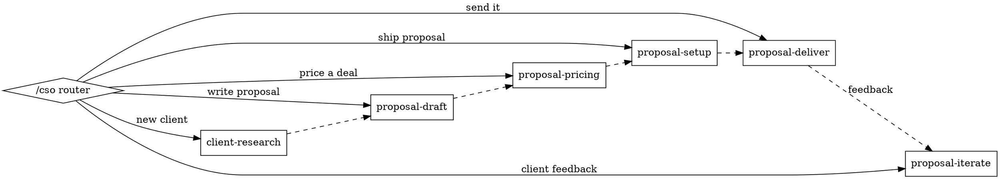

# CSO Skill Suite Design

**Date:** 2026-03-18
**Status:** Draft
**Authors:** Tom Weaver, Claude

## 1. Problem

The CSO role exists but has no operating playbook. Today's Live Beyond proposal was built manually through hours of iteration between Tom and Claude. The process — research, draft, price, ship, iterate — needs to be codified into a reusable skill suite so the CSO can produce proposals autonomously (with approval gates) for future clients.

## 2. Architecture

A monolithic skill suite at `.agents/skills/cso/` with a router and six sub-skills. Follows the `superpowers` pattern: one entry point (`/cso`) that routes to the right sub-skill based on context.

```
.agents/skills/cso/
  SKILL.md              ← router
  client-research.md    ← ingest docs, synthesise client brief
  proposal-draft.md     ← write proposal sections
  proposal-pricing.md   ← structure commercial terms
  proposal-setup.md     ← create DB record, configure access
  proposal-iterate.md   ← handle feedback, update content
  proposal-deliver.md   ← set status, notify, track
```

### Flow



**Entry points are flexible** — the CSO can jump in at any stage. Each skill checks for prerequisites and prompts for missing context rather than forcing a linear flow.

### Convention

Every sub-skill expects a `CLIENT_NAME` (the folder name under `sales/`). If only one active deal exists, it auto-selects. If multiple, it asks.

### Directory Structure

```
sales/
  {client-name}/
    docs/
      input/              ← client docs, briefs, requirements
      meetings/           ← transcripts, notes
      brand/              ← logos, colours, fonts
      external-assets.md  ← pointer to large assets outside repo
      client-brief.md     ← synthesised brief (output of client-research)
      proposal-plans/
        draft-v{n}.md     ← versioned drafts
        pricing.json      ← structured pricing data
        changelog.md      ← iteration log
        proposal-id.txt   ← live proposal UUID
```

## 3. Sub-Skills

### 3.1 Client Research (`client-research.md`)

Ingest and organise information about a prospective client.

**Two modes:**

**Mode 1 — Organise a dump:** Someone drops files into `sales/{client}/`. The skill scans, identifies types (transcripts, brand docs, requirements, images), organises into the standard structure, and produces a client brief.

**Mode 2 — Research from scratch:** Given a client name, website, or LinkedIn. Uses `deep-research` and `x-scan` to gather public info. Creates the directory structure and produces the brief.

**External assets:** If assets are too large for the repo (e.g. 2GB brand folder), creates `docs/external-assets.md` with the path so other skills know where to look without copying into the repo.

**Output:** `sales/{client}/docs/client-brief.md` containing:
- Client name, key contacts, their roles
- What they need (in their words, not ours)
- Timeline pressures / deadlines
- Budget signals (quotes they've had, what they've said about money)
- Decision makers and approval process
- Competitive context (who else they might be talking to)
- Brand notes (colours, fonts, tone — if brand assets available)

The brief is the CSO's single source of truth about the client. Every downstream skill reads it.

### 3.2 Proposal Draft (`proposal-draft.md`)

Write the actual proposal content.

**Input:** `client-brief.md` (required — if missing, routes back to client-research)

**Process:**
1. Read client brief and any meeting notes/transcripts
2. Check DB for existing proposals — reuse standard sections (team bios, Zazig Platform, scalability) as templates. Only client-specific sections get written from scratch.
3. Determine engagement type (managed service, advisory, project-based) — ask if unclear
4. Draft sections in order, presenting each for approval:
   - Executive Summary
   - The Opportunity (framed in client's own language)
   - Pilot Sprint (if applicable)
   - Phases (however many make sense — not hardcoded)
   - The Team (standard bios, adapted positioning for client context)
   - Built for Scale (if relevant)
   - Timeline
   - Next Steps
5. Each section written as markdown

**Key behaviours:**
- Uses the CSO's active personality archetype (Relationship Builder writes differently from Closer or Evangelist)
- Frames everything in the client's own language (from transcripts/brief)
- Anchors against the alternative cost when that data exists
- Team section adapts framing per client — for a longevity platform, lead with scaling experience; for fintech, lead with YC/investor credibility
- Does NOT touch pricing — that's the next skill

**Output:** `sales/{client}/docs/proposal-plans/draft-v{n}.md`

### 3.3 Proposal Pricing (`proposal-pricing.md`)

Structure the commercial terms. Separate from content because pricing needs its own focused conversation.

**Input:** The draft from proposal-draft (reads phases to understand scope)

**Process:**
1. Read draft to understand phases and deliverables
2. Calculate timeline — count months per phase based on deadlines in client brief
3. Propose per-role breakdown using standard rates as starting point:

**Standard rate card (internal — never shared with clients):**

| Role | Phase 1 (fully managed) | Phase 2+ (partially managed) |
|------|------------------------|------------------------------|
| Tom Weaver (CPO) | $1,500/mo | $750/mo |
| Chris Evans (CTO) | $1,500/mo | $750/mo |
| Autonomous Execs & Workers | $1,000/mo | $500/mo |
| Infrastructure (compute, subs) | $1,000/mo | $1,500/mo |

4. Present breakdown, per-phase total, overall total
5. Ask about commercial structure — loan note, cash, hybrid? Default: loan note repaid after seed or >$300K
6. Ask about off-ramps — default: exit at each phase boundary, all IP transferable
7. Produce structured pricing data

**Output:** Pricing block appended to draft + `sales/{client}/docs/proposal-plans/pricing.json`

**Guardrails:**
- Never share the rate card with clients
- Always anchor against the alternative cost
- Flag if total is below $20K (may not be worth the engagement)
- Infrastructure at launch scale always borne by client — never in the loan note

### 3.4 Proposal Setup (`proposal-setup.md`)

Turn the draft and pricing into a live proposal page.

**Input:** Draft markdown + `pricing.json`

**Process:**
1. Read draft and pricing files
2. Check DB for existing proposals to use as structural templates
3. Convert markdown sections into `content` jsonb structure
4. Collect: client name, logo (copy to `public/brand/` if local), brand colour, allowed emails, valid_until, prepared_by
5. Create proposal via `create-proposal` edge function or direct DB insert
6. Update Vercel rewrite if new brand asset paths need excluding
7. Report the proposal URL

**Also handles:**
- Adding emails to allowlist
- Setting `valid_until` date
- Storing proposal ID in `sales/{client}/docs/proposal-plans/proposal-id.txt`

**Output:** Live proposal URL

**Guardrails:**
- Status stays `draft` until explicitly told to send
- Confirm URL works before reporting success
- Never auto-send

### 3.5 Proposal Iterate (`proposal-iterate.md`)

Handle feedback rounds on a live proposal.

**Input:** Proposal ID + feedback (verbal, screenshots, written notes)

**Process:**
1. Fetch current proposal content from DB
2. Parse feedback — determine if content change (DB update) or component change (code):
   - Content → update via REST API, instant, no deploy
   - Component → modify Proposal.tsx/global.css, commit, push, wait for Vercel
3. Apply changes
4. Verify — screenshot via Playwright or prompt user to refresh
5. Log in `sales/{client}/docs/proposal-plans/changelog.md`

**Key behaviour:**
- Always fetch current state before modifying
- Content changes are instant
- Component changes need push + deploy cycle
- After each round, ask "anything else?"

**Output:** Updated proposal in DB + changelog entry

### 3.6 Proposal Deliver (`proposal-deliver.md`)

Send the proposal and track engagement.

**Input:** Proposal ID, confirmation to send

**Process:**
1. Pre-flight checks:
   - All sections have content (no empty body_md)
   - Pricing populated
   - `allowed_emails` has at least one client email
   - `valid_until` set and in future
   - Brand assets load correctly
2. Change status from `draft` to `sent`
3. Compose notification for Tom to send (email text + proposal URL). When Resend is integrated, send automatically.
4. Log delivery in changelog
5. Note: `proposal_views` tracks engagement automatically

**Post-delivery:**
- Client clicks "Start Pilot Sprint" → status changes to `accepted`, event logged
- No view after 48 hours → CSO drafts follow-up nudge
- `declined` → log reason if given

**Guardrails:**
- Never send without explicit approval from Tom
- Include proposal URL in notification, never the raw content
- Flag if `valid_until` is less than 7 days away

**Output:** Status `sent`, notification composed

## 4. Skill Registration

The CSO role's `skills` array in the DB should be updated to include `cso` (the router). The sub-skills are loaded by the router, not registered individually.

Current skills: `{brainstorming, internal-proposal, review-plan, deep-research, x-scan}`
Updated: `{cso, brainstorming, internal-proposal, review-plan, deep-research, x-scan}`

## 5. What We're NOT Building

- No CRM table (future — the CSO will eventually need deal tracking)
- No automated email (Resend integration deferred)
- No multi-proposal comparison or analytics dashboard
- No automated follow-up sequences
- No client-side proposal editing

## 6. Relationship to Existing Skills

| Existing Skill | Relationship |
|---------------|-------------|
| `internal-proposal` | Different purpose — internal RFCs, not client proposals |
| `brainstorming` | CSO may invoke this during draft phase for creative exploration |
| `deep-research` | Called by client-research for Mode 2 (research from scratch) |
| `x-scan` | Called by client-research for social/market context |
| `review-plan` | Could be used to stress-test a proposal before sending |
