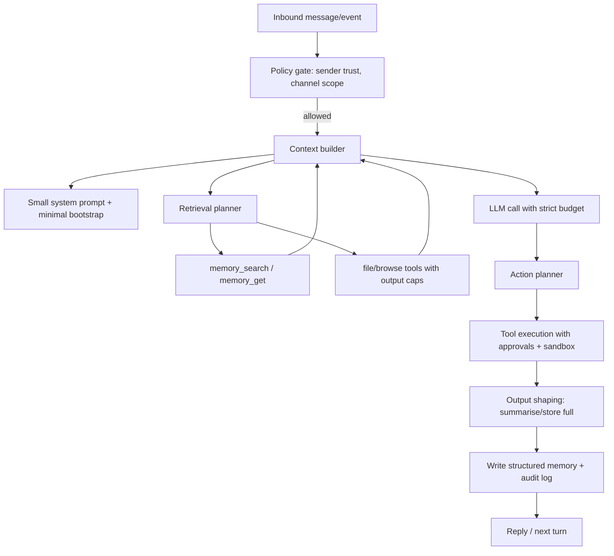
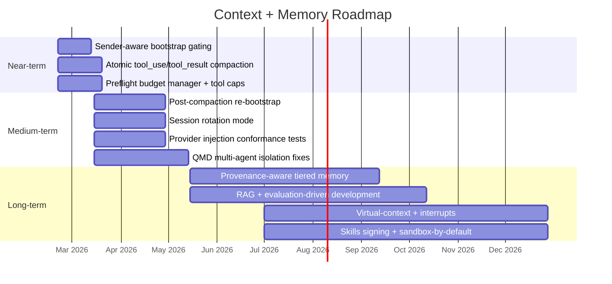

# OpenClaw soul.md and context management: flaws, root causes, and improvement roadmap

## Executive summary

This report synthesises what practitioners and reviewers describe as the recurring failure modes of OpenClaw’s `SOUL.md`-centred identity system and its broader context-management pipeline, drawing primarily from official documentation and high-signal GitHub issues/discussions, then triangulating with community posts and security/engineering commentary. citeturn11view0turn21view0turn22view0turn10view0turn12view0turn13view0turn14view2turn15view1

Two design choices explain a large fraction of the criticisms:

OpenClaw injects a fixed set of “bootstrap” workspace files (including `SOUL.md`) into the model context “on every turn”, subject to per-file and total-size truncation caps; and it persists session history to disk and uses compaction (summarisation) when contexts approach window limits. citeturn11view0turn38view1turn10view0

The most frequently reported flaws cluster into seven themes:

Token and context bloat (especially from tool schemas, long tool outputs, and generous snapshot defaults), leading to frequent overflows and degraded reasoning; compaction that can corrupt tool-call structure or cause “amnesia” (loss of behavioural rules/persona continuity); privacy boundary failures (owner-only context injected for non-owners); reliability gaps across providers (notably OpenAI-compatible “openai-completions” local backends failing to inject bootstrap files); and systemic security exposure from mixing untrusted content, high-privilege tooling, and persistent memory. citeturn38view1turn14view2turn15view1turn13view0turn13view1turn34view0turn34view1turn36view0

On improvements, the most actionable and “highest-leverage” interventions described or implied by maintainers and experienced users are: (a) explicit, enforceable context-scoping based on sender trust/ownership; (b) atomic handling of tool-use/tool-result pairs through truncation/compaction; (c) a hard preflight “context budget manager” that can shed tool payloads or lower `max_tokens` before a request; (d) shifting from “always-inject files” to “just-in-time context” and tiered memory architectures; and (e) security-by-default hardening—treating web/tool outputs as untrusted, constraining skills and hooks, and building auditability into memory writes. citeturn13view0turn14view1turn14view2turn36view0turn26view0turn34view0

Where this report makes technical causal attributions beyond what is explicitly stated in the sources, those statements are marked as [Inference]. Where a detail is directly inaccessible or cannot be confirmed from primary sources in the collected material, it is marked [Unverified] and the limitation is stated plainly.

## Intended design of soul.md and context-management features

OpenClaw’s workspace model treats `SOUL.md` as one of several “standard files” that define an agent’s persona, tone, and boundaries, alongside `AGENTS.md` (operating instructions), `USER.md` (user profile), `IDENTITY.md`, `TOOLS.md`, and optional `MEMORY.md` plus daily logs under `memory/YYYY-MM-DD.md`. citeturn22view0turn12view0turn21view0

The official template frames `SOUL.md` as an identity/behaviour document (“who you are”), containing principles (“Core Truths”), explicit behavioural constraints (“Boundaries”), style guidance (“Vibe”), and an explicit continuity instruction: these files are “your memory”, and the model should read/update them; the template also explicitly tells the agent to evolve the file over time and to notify the user if it changes. citeturn21view0

Operationally, OpenClaw builds a custom system prompt on every run, and (crucially) it appends “workspace bootstrap injection” under “Project Context”: a fixed set of workspace files—including `SOUL.md`—are automatically trimmed and injected, consuming tokens every turn. Defaults include `agents.defaults.bootstrapMaxChars` (20,000 chars per file) and `agents.defaults.bootstrapTotalMaxChars` (150,000 chars total), with missing-file markers and with sub-agents receiving a reduced set to keep context small. citeturn11view0turn38view1turn22view0

The official “Context” tooling (`/context list` and `/context detail`) exists to make this overhead observable, including non-obvious costs such as tool schemas, which count against the context window even though they may not be shown as plain text to the user. citeturn38view1

Session state is owned by a single Gateway process and persisted in two layers: a mutable session store (`sessions.json`) and append-only transcript files (`*.jsonl`) that store conversation turns, tool calls/results, and compaction summaries. Compaction is persistent: older turns are summarised into a transcript entry and future turns see the summary plus the retained recent messages. citeturn10view0

To mitigate loss from compaction, OpenClaw implements a pre-compaction “memory flush”: when a session approaches compaction thresholds, it runs a silent, agentic turn (using the `NO_REPLY` convention) intended to push durable state into workspace memory files (typically the daily log) before compaction occurs. citeturn10view0turn12view0

Memory, in OpenClaw’s intended design, is “plain Markdown in the agent workspace” and the files are the source of truth; retrieval is supported through `memory_search` (semantic recall) and `memory_get` (targeted reads). The official docs describe a hybrid retrieval approach (BM25 + vector search, with diversity/reranking features and an optional experimental QMD backend) and emphasise scoping controls. citeturn12view0

Two security-relevant design statements in the official docs are material to later criticisms:

The system prompt includes “safety guardrails” but they are described as advisory rather than policy enforcement; enforcement is expected to come from tool policy, approvals, sandboxing, and allowlists, which operators can disable by design. citeturn11view0

The injection step can be intercepted by internal hooks during `agent:bootstrap` to mutate or replace injected bootstrap files (the docs even give “swap `SOUL.md` for an alternate persona” as an example). citeturn11view0

## Recurring flaws and criticisms across discussions

The themes below are aggregated from GitHub issues/discussions, plus community posts and security/engineering write-ups. The intent here is to show (a) what people complain about repeatedly, and (b) how those complaints map to specific, inspectable mechanisms.

### Context bloat, overflow loops, and “token surprise”

A recurring complaint is that a session can exceed the model context limit abruptly when a tool returns a large payload; this can yield repeated “context too long” failures, retries, and stalled automation until a manual reset. A representative issue describes tool results hundreds of thousands of characters long being appended to transcripts and immediately pushing prompts beyond large (200K token) windows; the suggested fixes emphasise preflight budgeting, result caps, and summarising oversized outputs while storing full text elsewhere. citeturn14view2turn14view3

Related complaints occur when multiple “medium sized” tool results collectively overflow; one open issue argues that overflow recovery can miss aggregate oversize and jump to session reset, destroying history. citeturn14view3

A complementary thread argues that default browser snapshot payloads are too large (e.g., 80K chars), proposing lower defaults plus progressive truncation hints that teach the model to request “efficient” snapshots or smaller reads. citeturn20view0

These concerns align with OpenClaw’s own acknowledgement that “everything the model receives counts”, including tool calls/results and hidden wrapper overhead, and that tool schemas can be a dominant token cost. citeturn38view1turn11view0

### Tool-call structural corruption from truncation/compaction

Multiple issues report hard API errors when truncation or compaction detaches `tool_result` blocks from their corresponding `tool_use` blocks, violating provider constraints (one example is Anthropic’s requirement that each `tool_result` have a matching `tool_use` in the previous assistant message). The typical user-visible symptom is a 400 response and sometimes a “crash loop” until the session is fully restarted. citeturn14view0turn14view1

### Compaction “amnesia” and persona/rules drift

Beyond structural corruption, a widely reported qualitative failure mode is that the agent “forgets who it is” or stops following workflow and safety rules after compaction. One issue (closed “not planned”) describes the post-compaction session losing awareness of injected context files and thus skipping verification steps or “Red Lines.” citeturn15view0

A newer feature request argues that OpenClaw’s default pre-compaction memory flush is helpful but insufficient because it does not reliably preserve the procedural directive to re-bootstrap the workspace files after compaction; it cites community workarounds (“Total Recall”, “badger test”) and proposes generating a workspace-aware bootstrap directive that is explicitly inserted so it survives summarisation. citeturn15view1

This theme is echoed in independent commentary. entity["people","Alexis Gallagher","software engineer writer"] describes the system as charming but “fall[ing] apart due to context rot” and claims the out-of-the-box memory system is insufficient to preserve continuity across compaction boundaries. citeturn16view0turn36view0

The underlying long-context degradation problem (“context rot”) is widely discussed in agent engineering more broadly; entity["company","Anthropic","ai model provider"] explicitly argues that more tokens can yield diminishing returns and reduced recall/precision, motivating “context engineering” as iterative curation rather than maximal stuffing. citeturn36view0turn36view1

### Privacy boundary failures between owner and non-owner sessions

A high-impact critique is that OpenClaw’s current bootstrap loading path can ignore sender ownership and inject private owner context (e.g., from `USER.md`, potentially `MEMORY.md`) even for non-owner senders when a channel is configured to accept external DMs. One issue provides a concrete reproduction: ask the agent what it knows about who it is speaking to; it may reveal the owner’s personal details because bootstrap files are loaded unconditionally in prompt construction, while `senderIsOwner` is only used for tool filtering. citeturn13view0turn11view0turn22view0

This is in tension with the intended documentation stance that `MEMORY.md` is “only load[ed] in the main, private session (never in group contexts)”, suggesting either an implementation gap, a configuration nuance, or both. citeturn12view0turn22view0

### Provider compatibility and “SOUL.md ignored” reports

A cluster of issues report that bootstrap files are not injected when using certain local backends that implement the OpenAI API surface. One closed bug reports that when using a local LLM via an “openai-completions” API (e.g., via Ollama), `SOUL.md`/`USER.md` content does not arrive in the Project Context, prompting the model to incorrectly try `memory_get` for those paths, then hallucinate or claim it lacks the information. citeturn13view1

A related open issue reports local models “ignoring” `SOUL.md` and failing to read memory, raising the recurring question of whether the problem is the runtime injection path, context-window settings, or model/tool-use ability. citeturn13view2

### Ambiguous boundaries and “identity file sprawl”

A common community-level confusion is how to separate “persona”, “user profile”, and “memory”. One widely shared Reddit post says the author’s early approach “turned into a mess” (drift, duplication, unclear boundaries), then proposes a clearer separation model: treat soul.md as a relatively stable “constitution” rather than personality fluff; treat user.md as a working contract; and treat memory.md as curated durable facts with expiry and provenance—and warns that letting untrusted content modify identity files is a direct path to memory poisoning. citeturn27view0turn34view1

There is a clear tension here with the official `SOUL.md` template’s encouragement that the file is “yours to evolve”, which some operators view as dangerous (identity drift) even when well intentioned. citeturn21view0turn27view0

### Security: prompt injection + persistent memory + high-privilege tools

Security commentary converges on a structural claim: agentic systems are hard to secure when they combine untrusted inputs, high-privilege tool access, and the ability to communicate externally.

entity["people","Simon Willison","software developer writer"] coined the “lethal trifecta” framing of these three capabilities for agents. citeturn5search0turn34view0

entity["company","Palo Alto Networks","cybersecurity company"] then argues that persistent memory effectively adds a fourth accelerant: attackers can plant instructions that do not need immediate execution, are written into long-term memory, and later “detonate” when state/tool availability aligns (time-shifted prompt injection, memory poisoning, logic-bomb activation). citeturn34view0turn34view1

entity["organization","Unit 42","palo alto threat research"] provides a concrete PoC of indirect prompt injection poisoning an agent’s long-term memory by manipulating a session summarisation process, stressing that models cannot reliably distinguish benign from malicious input once incorporated into system prompts, and that layered mitigations are required. citeturn34view1

Supply chain risk via “skills” is another repeated theme. entity["company","Snyk","developer security platform"] reports scanning thousands of agent skills and finding a large fraction with critical flaws, including prompt injection and malicious payloads, and explicitly calls out persistent memory as a persistence mechanism attackers can abuse (including reviewing `SOUL.md`/`MEMORY.md` for unauthorised modifications). citeturn16view2

Related operational guidance from entity["company","FleetDM","endpoint management company"] frames `SOUL.md` and `MEMORY.md` modifications as “memory poisoning” and provides detection queries; it also highlights transcript files (`*.jsonl`) as durable sensitive artifacts. citeturn17view0turn10view0turn22view0

The “soul-evil” episode illustrates how trust in the bootstrap/identity layer can become a public flashpoint. An external LinkedIn thread claims a bundled “persona swap” hook could replace `SOUL.md` in memory with an alternate file via a purge window or random chance and argues that, because the agent can change config, prompt injection could enable it. citeturn32view0turn11view0  
OpenClaw’s release notes for version 2026.2.12 state that the project removed a bundled “soul-evil” hook and also shipped multiple hardening changes, including treating browser/web content as untrusted by default and stripping some tool-result details from model-facing transcript/compaction inputs to reduce prompt-injection replay risk. citeturn26view0

Finally, enterprise pushback and “future viability” debates are visible in mainstream coverage: entity["organization","WIRED","technology magazine"] reports internal company warnings/bans, citing unpredictability and privacy breach risks, and the idea that “the bot can be tricked” (e.g., a malicious email instructing the assistant to share files). citeturn39view4turn34view1

## Root-cause analysis

[Inference] The recurring failures above are less about any single bug and more about architectural coupling: OpenClaw’s design co-locates “identity/instructions” (`SOUL.md` and friends), “state/history” (JSONL transcripts + compaction summaries), and “untrusted inputs” (web pages, messages, third-party skill content) inside one token stream that is repeatedly re-assembled and fed to a stochastic model with limited attention. This is consistent with OpenClaw’s explicit “everything counts” context definition and with security research emphasising that models cannot reliably separate data from instructions once ingested. citeturn38view1turn34view1turn36view0

[Inference] Architecture and state management: The Gateway-as-source-of-truth plus persisted JSONL transcripts is operationally simple, but compaction turns “history management” into a lossy transformation on the same data structure that must also satisfy tool-call protocol invariants. The tool-use/tool-result mismatch errors indicate compaction/truncation is not treating tool interactions as atomic units; once the transcript is corrupted, retries can deterministically reproduce the same invalid request (a “crash loop”). citeturn10view0turn14view1turn14view0

[Inference] Prompt engineering and multi-turn coherence: Always injecting bootstrap files each turn is a brute-force way to preserve persona, but it competes directly with task context and tool results for attention budget. That trade-off gets worse as files grow (especially `MEMORY.md`) and as tool schemas expand. This aligns with OpenClaw’s own warning that injected files consume tokens and can drive more frequent compaction, and with broader “context rot” evidence: longer contexts can reduce recall and reasoning precision, particularly for information not at the edges of the prompt. citeturn11view0turn38view1turn36view0turn36view1

[Inference] Latency and scalability: The combination of large prompts, large tool outputs, and frequent retries on overflow creates multiplicative cost and latency. Issues describing single-step overflows and repeated failures are consistent with missing or incomplete preflight budgeting and missing “output shaping” at tool boundaries. citeturn14view2turn14view3turn20view0turn36view0

[Inference] Provider heterogeneity: Reports that bootstrap injection fails on OpenAI-compatible “openai-completions” paths suggest the system prompt assembly may not be consistently propagated to all provider adapters or may be dropped/rewritten by wrapper logic. When this fails, the model falls back to tool calls that are semantically inappropriate (e.g., `memory_get` for non-memory paths) and may then hallucinate. citeturn13view1turn13view2turn12view0

[Inference] Privacy and personalisation: The owner/non-owner context leak issue appears to be caused by a missing policy gate at a critical boundary: context assembly includes bootstrap files regardless of sender trust, even though ownership is already computed and used elsewhere (e.g., tool filtering). This is a classic “policy applied too late” bug: once private information is in the prompt, “don’t reveal secrets” instructions are advisory and can be bypassed by model error, prompt injection, or normal conversational probing. citeturn13view0turn11view0turn34view1

[Inference] Security and need for hard boundaries: The most credible “root cause” framing in the sources is that prompt injection is unsolved at the model level and must be mitigated structurally: treat untrusted input as adversarial, enforce access control on tools and memory, and avoid giving a single agent both untrusted ingestion and privileged action execution with shared memory. That aligns with the lethal trifecta/quartet framing and with OpenClaw’s own admission that system-prompt guardrails are advisory and enforcement must come from sandboxing, tool policy, and allowlists. citeturn34view0turn34view1turn11view0turn26view0

## Concrete, actionable improvements

The proposals below are framed as engineering changes you could implement in OpenClaw-like systems. Each item includes trade-offs and an effort estimate. Where efficacy claims are probabilistic rather than certain, they are marked [Inference] and backed by relevant sources.

### A reference model for a safer, smaller context

[Inference] The highest-level design shift suggested by multiple sources is to move from “load big state into context” toward “keep context small and retrieve just-in-time”, combining compaction, structured note-taking, and sub-agent isolation. This mirrors entity["company","Anthropic","ai model provider"]’s context-engineering guidance (compaction + note-taking + sub-agents), and is consistent with OpenClaw’s own tool-on-demand skill loading and memory retrieval tooling. citeturn36view0turn11view0turn12view0

A practical target architecture looks like:

[Inference] This architecture explicitly inserts two mechanisms missing in many failure reports: (a) an early policy gate, before context assembly, and (b) a context budget manager before the model call. The former directly addresses owner/non-owner leakage; the latter addresses single-step overflow loops. citeturn13view0turn14view2turn34view1turn36view0

### Hardening the bootstrap and identity layer

[Inference] Implement sender-aware bootstrap filtering. The GitHub issue on owner leakage already sketches three viable designs: file-level gating (e.g., do not inject `USER.md` / `MEMORY.md` for non-owners), section-level gating (owner-only markers to strip), or separate restricted workspaces for non-owner sessions. This should be implemented at `resolveBootstrapContextForRun()` (or equivalent) before any prompt is built. citeturn13view0turn22view0turn11view0  
Pros: directly fixes a concrete privacy bug; reduces prompt size for untrusted sessions. citeturn13view0turn11view0  
Cons: requires clear semantics for which files/sections are safe; misconfiguration could break personalisation for legitimate users.  
[Inference] Complexity estimate: Medium (1–2 weeks), because it touches routing, prompt assembly, tests, and documentation.

[Inference] Add an explicit “PUBLIC.md / PUBLIC_SOUL.md” surface for externally reachable sessions. One recurrent operator desire is to expose an agent publicly without injecting private user identity and memory. A dedicated public persona file (plus a public user profile) makes the “least privilege” default tangible. This idea follows naturally from the file-role mapping in the workspace docs and from the leakage issue’s suggested fix. citeturn22view0turn13view0  
Pros: reduces accidental disclosure risk; improves usability for multi-user deployments.  
Cons: more files to manage; needs clear documentation to prevent misuse.  
[Inference] Complexity estimate: Medium.

[Inference] Make `SOUL.md` evolution opt-in or gated behind approvals. The official template encourages the agent to evolve its soul, but community guidance often recommends that identity rules be stable and human-reviewed to prevent drift and poisoning. A concrete mechanism is: agents may propose diffs to `SOUL.md`/`USER.md`, but actual writes require explicit approval (similar to exec approvals). citeturn21view0turn27view0turn11view0turn34view1  
Pros: materially reduces memory-poisoning persistence; improves operator trust. citeturn34view1turn17view0  
Cons: reduces autonomy; adds friction for “living persona” enthusiasts.  
[Inference] Complexity estimate: Low–Medium (days to 1 week), depending on existing approvals plumbing.

### Making compaction safe and predictable

Treat tool-use and tool-result messages as atomic units. This is the direct fix requested by multiple issues: if compaction/truncation removes a `tool_use`, it must remove corresponding `tool_result` entries too (and vice versa), preserving provider constraints. citeturn14view0turn14view1  
Pros: prevents hard API failures and crash loops. citeturn14view1  
Cons: can reduce retained context more aggressively than today.  
[Inference] Complexity estimate: Medium (1–2 weeks), because it requires transcript graph analysis and robust tests across providers.

[Inference] Make post-compaction re-bootstrap a first-class behaviour. The open feature request suggests generating a workspace-aware bootstrap directive during the pre-compaction memory flush so the directive survives summarisation. This can be improved further by having the runtime explicitly re-inject bootstrap files after compaction (or by triggering a lightweight “boot” hook) rather than hoping the model follows instructions embedded in the summary. citeturn15view1turn10view0turn11view0  
Pros: reduces “persona/rules amnesia”; improves long-horizon coherence. citeturn15view1turn16view0turn36view0  
Cons: increases token usage immediately after compaction; adds complexity to compaction lifecycle.  
[Inference] Complexity estimate: Medium.

[Inference] Offer a “rotate session” mode as an alternative to compaction. One open feature request argues that compaction is inherently lossy, that some channels cannot easily run `/new`, and that operators with external memory backends would prefer automatic session rotation plus a memory flush. citeturn24view3turn10view0turn12view0  
Pros: avoids lossy summaries; restores clean bootstrap state automatically. citeturn24view3turn22view0  
Cons: requires strong external memory/retrieval to avoid losing active context; could fragment conversational continuity.  
[Inference] Complexity estimate: Medium.

### Context budgeting and tool-output shaping

Implement a strict preflight budget manager before every LLM call. The budget manager should ensure `estimated_input_tokens + requested_output_tokens <= context_window` and should have a deterministic policy ladder: (1) trim/summarise newest tool results; (2) lower requested `max_tokens`; (3) compact; (4) rotate/reset as last resort. This is explicitly requested in the “sudden context overflow” issue. citeturn14view2turn10view0  
Pros: prevents repeated hard-failure loops and surprise bills; improves reliability. citeturn14view2turn38view1  
Cons: budget estimation is provider-dependent (“tracked tokens” are best-effort); may require instrumentation changes. citeturn10view0  
[Inference] Complexity estimate: Medium.

Externalise large tool outputs and store only references + summaries in the transcript. A safe pattern is: store the full output in a separate file (or object store), keep a short summary + provenance pointer in context, and require explicit reads for deep inspection. This mirrors broader “just in time” context strategies and reduces exposure to tool-output injection replay. citeturn36view0turn26view0turn14view2  
Pros: reduces context load; limits prompt-injection surface in future turns. citeturn26view0turn34view1  
Cons: additional storage and lifecycle management; requires good UX for “show me more.”  
[Inference] Complexity estimate: Medium–High.

Default to smaller snapshots and progressive disclosure hints. The snapshot-size discussion proposes reducing defaults (e.g., 80K → 10K chars) and teaching the model about “efficient” snapshot modes only when truncation occurs. citeturn20view0turn36view0  
Pros: lower baseline token burn; fewer overflows on content-heavy pages. citeturn20view0  
Cons: may reduce task success on pages where the needed detail is not in the first chunk; requires model retraining? [Inference] likely not, but careful prompt/tool design is needed.  
[Inference] Complexity estimate: Low–Medium.

### Memory architecture upgrades for continuity, relevance, and privacy

[Inference] Move from “flat memory” to tiered memory with explicit trust and provenance. A credible security critique is that undifferentiated memory (web scrapes, user commands, tool outputs) stored identically invites poisoning; the Palo Alto analysis explicitly lists “memory poisoning” as a risk when “all memory is undifferentiated by source” and lacks trust levels or expiration. citeturn34view0turn34view1turn27view0  
A practical implementation is to store memory entries as structured records (YAML frontmatter or JSON sidecar) with: source type, sender identity, timestamp, expiry, and a “trust tier” (owner-verified, system-generated, untrusted).  
Pros: enables safer recall policies and safer long-term personalisation.  
Cons: schema migration and tool updates; more complex mental model.  
[Inference] Complexity estimate: High (multi-week).

Adopt a retrieval-augmented generation loop for grounding and lower context footprints. RAG provides non-parametric memory via retrieval and can improve factual grounding when paired with citations; it is widely used and formalised in the RAG literature. citeturn37search0turn37search4turn36view0  
Pros: reduces need to inject large files; improves traceability via retrieved sources. citeturn37search0turn36view0  
Cons: requires search infrastructure, chunking, embedding, and evaluation; retrieval errors become a new failure mode. citeturn37search6turn12view0  
[Inference] Complexity estimate: Medium–High.

[Inference] Use “virtual context management” (OS-inspired memory paging) for long-horizon tasks. Systems like MemGPT explicitly frame an agent memory hierarchy plus interrupts to manage limited context windows. This maps directly onto OpenClaw’s long-running assistant goal and its existing `NO_REPLY` silent-turn convention. citeturn37search1turn10view0turn11view0  
Pros: improves continuity without stuffing everything into the prompt. citeturn37search1turn36view0  
Cons: substantial architecture change; requires careful interrupt semantics and user experience design. citeturn37search1  
[Inference] Complexity estimate: High.

Fix multi-agent memory isolation in QMD mode and add per-agent scoping controls. The QMD backend is explicitly described as experimental, and open issues report incorrect session indexing (default agent sessions used for all agents) and lack of per-agent collection path overrides, which introduces relevance noise and potential cross-agent confusion. citeturn12view0turn19view2turn19view1  
Pros: better multi-agent relevance; reduces accidental cross-contamination. citeturn19view1turn19view2  
Cons: adds configuration surface area; requires robust tests in multi-agent environments.  
[Inference] Complexity estimate: Medium.

### Security-by-default deployment improvements

Treat tool outputs and web content as untrusted objects with explicit provenance, and prevent replay into summaries. OpenClaw’s 2026.2.12 release notes indicate movement here: wrapping browser/web outputs with structured external-content metadata and stripping some tool-result detail from transcript/compaction inputs to reduce injection replay risk. citeturn26view0turn34view1  
Pros: reduces a major class of indirect prompt injection vectors. citeturn34view1  
Cons: may reduce task performance if the model needs raw content; requires “expand on demand” tooling.  
[Inference] Complexity estimate: Medium.

[Inference] Strengthen the skills ecosystem with signing/verification and sandbox-by-default. Third-party skills are described as inheriting agent privileges, and security reporting suggests the ecosystem is already under active attack at scale. citeturn16view2turn34view0turn39view4  
Pros: reduces supply-chain risk and unaudited privilege escalation. citeturn16view2  
Cons: hard operational problem (key management, review workflows, backward compatibility).  
[Inference] Complexity estimate: High.

### Evaluation metrics, tests, and continuous validation

Adopt evaluation-driven development for memory and retrieval. Tools like RAGAS provide reference-free metrics for RAG pipeline quality (faithfulness, relevance, etc.), and the underlying paper formalises automated evaluation. citeturn37search6turn37search2  
Pros: turns “vibe checks” into measurable regressions; helps prevent compaction/memory changes from silently degrading. citeturn37search2  
Cons: metrics can be gamed; requires representative test corpora and attack cases.  
[Inference] Complexity estimate: Medium.

[Inference] Add red-team suites for prompt injection and memory poisoning. Unit 42 explicitly states no complete solution exists for eliminating prompt injection, and layered mitigations plus continuous monitoring are required; that implies you need continuous adversarial testing (direct, indirect, stored/persistent). citeturn34view1turn16view2  
Pros: catches regressions and emergent vulnerabilities earlier; improves operator confidence.  
Cons: ongoing maintenance; real-world coverage is never complete.  
[Inference] Complexity estimate: Medium–High.

### Comparison table of proposed solutions

[Inference] The ratings below are qualitative estimates (impact on reliability/safety, engineering difficulty, and operational risk of regressions).

| Proposal | Primary flaw addressed | Expected impact | Difficulty | Risk profile |
|---|---|---:|---:|---|
| Sender-aware bootstrap filtering + PUBLIC persona | Privacy leakage; over-injection | High | Medium | Medium (mis-scoping) |
| Atomic tool-use/tool-result compaction and truncation | Provider 400 loops | High | Medium | Low–Medium |
| Preflight context budget manager + policy ladder | Overflow loops; token spikes | High | Medium | Medium |
| Externalise tool outputs + reference pointers | Token bloat; injection replay | High | Med–High | Medium |
| Post-compaction re-bootstrap as runtime feature | Amnesia/drift after compaction | Medium–High | Medium | Medium |
| Session rotation mode instead of compaction | Lossy summaries; channel UX | Medium | Medium | Medium |
| Tiered memory with provenance/trust/expiry | Memory poisoning; relevance | High | High | Medium–High |
| RAG-backed retrieval with citations | Hallucination; context size | Medium–High | Med–High | Medium |
| QMD per-agent scoping + isolation fixes | Cross-agent contamination | Medium | Medium | Low–Medium |
| Skill signing + sandbox-by-default | Supply chain compromise | High | High | Medium–High |

## Suggestions to improve autonomy, reactivity, and perceived assistant realism

OpenClaw’s current design already includes primitives that support “always-on” assistant behaviour—heartbeat runs, silent housekeeping via `NO_REPLY`, and persistent Markdown memory. citeturn10view0turn12view0turn21view0  
The critique in public discourse is not that autonomy is impossible, but that it is unreliable under long-horizon context pressure and creates unacceptable security exposure when paired with broad permissions. citeturn39view4turn34view0turn16view2

The following changes target autonomy and “realism” while explicitly reducing the failure modes above.

[Inference] Add an explicit behavioural state machine with interrupt handling. The goal is to reduce “mode confusion” (chatty vs executing vs waiting for approval) and to make the agent interruptible mid-run. MemGPT’s framing of interrupts and tiered memory is a useful reference point for this style of control flow, and OpenClaw already uses silent turns and session lifecycle hooks that can serve as interrupt vectors. citeturn37search1turn10view0turn11view0

[Inference] Introduce a first-class “approval contract” in `SOUL.md`/policy rather than prose-only rules. Community security setups often add spending limits, “do/don’t do” lists, and explicit “no posting externally” constraints in `SOUL.md`, but the docs clarify that many guardrails are advisory unless enforced via tool policy and approvals. Converting high-risk actions into enforceable contracts (e.g., “cannot call message-send tools without approval when target is non-owner”) improves both safety and user trust (“it feels real because it reliably stops”). citeturn31view0turn11view0turn34view1

[Inference] Build a user model that is *minimal, scoped, and auditable*. The intended role of `USER.md` is “who the user is and how to address them” and it is loaded every session; but the privacy leak issue shows the risk of conflating “owner profile” with “anyone chatting.” Use per-sender profiles with strict scoping (and default-deny in public channels), and store only operational preferences (formatting, timezone, risk tolerance), consistent with community best practice. citeturn22view0turn13view0turn27view0

[Inference] Upgrade long-term memory from “accumulate” to “curate + expiry + validation”. Multiple sources warn that memory files growing over time increase token usage and compaction frequency; security sources warn that persistent memory enables time-shifted prompt injection. Introduce memory TTLs, periodic validation prompts, and a “quarantine” area for untrusted candidate memories until approved. citeturn11view0turn34view0turn34view1turn27view0

[Inference] Improve perceived realism via “reactivity without verbosity”: event-driven micro-reactions (e.g., “I’ve queued that; here’s the next checkpoint”) and transparent status surfaces (`/status`, context usage reporting), but avoid flooding user chats. This aligns with OpenClaw’s existing emphasis on observability (`/context`, `/status`) and silent housekeeping conventions. citeturn38view1turn10view0

[Inference] Multimodal inputs should be treated as untrusted content by default. The 2026.2.12 release note explicitly moves toward treating browser/web content as untrusted by default and adding structured provenance metadata; extend this provenance model to images/audio attachments (source channel, sender, scan status) and forbid direct writes to identity/memory from untrusted multimodal content without human review. citeturn26view0turn34view1

## Roadmap and research directions

This roadmap is anchored to the problems evidenced in GitHub issues/releases and to the risk framing in major security research cited above.

### Near-term milestones

Implement sender-aware bootstrap gating and introduce a public persona layer. This directly addresses a concrete privacy bug and reduces prompt size in exposed deployments. citeturn13view0turn22view0

Fix atomic tool-use/tool-result handling in truncation and compaction to eliminate protocol-level crashes. citeturn14view0turn14view1turn10view0

Ship a strict preflight budget manager and output caps/summarisation for tool results to prevent single-step overflows and failure loops. citeturn14view2turn14view3turn38view1

### Medium-term milestones

Make post-compaction re-bootstrap explicit (runtime feature), and provide a compaction alternative (“rotate session”) for operators who prefer clean restarts over lossy summaries. citeturn15view1turn24view3turn10view0

Harden provider adapters to ensure bootstrap injection is consistent across OpenAI-compatible local backends; add conformance tests that verify `SOUL.md`/`USER.md` visibility across providers. citeturn13view1turn11view0turn38view1

Stabilise and isolate the QMD backend for multi-agent deployments (per-agent paths and correct session indexing). citeturn12view0turn19view1turn19view2

### Long-term milestones

Evolve memory into a tiered, provenance-aware system with trust levels, expiry, and quarantine; integrate retrieval-augmented generation and automated evaluation loops for memory quality and safety. citeturn34view0turn34view1turn37search0turn37search6turn37search2

Move toward OS-like virtual context management with interrupts, enabling long-horizon autonomy without ever-growing prompts. citeturn37search1turn36view0turn10view0

Strengthen the skills ecosystem with meaningful verification and sandbox-by-default, reflecting the observed supply-chain threat landscape. citeturn16view2turn34view0turn39view4

A visual summary:

[Unverified] Direct primary quoting from Twitter/X posts was not consistently accessible in the collected corpus via full post rendering; where this report references X-originating claims, it relies on cross-posted artefacts (e.g., GitHub gists) or other platforms quoting those posts. I cannot verify any additional X-only claims beyond what is reproduced in those accessible artefacts. citeturn31view0turn32view1turn30search0turn30search5