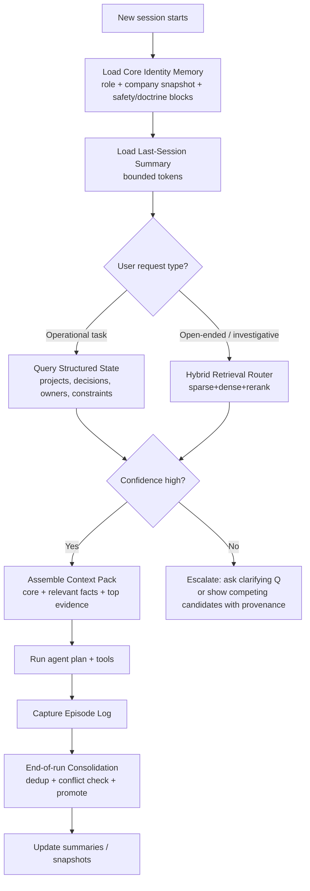
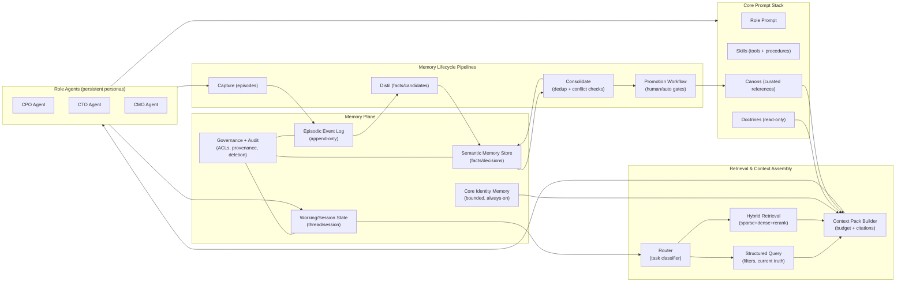

# Agentic Memory for Persistent Company Agents

## Executive summary

Persistent company agents (CPO/CTO/CMO) require memory that is **governed state**, not a dump of chat logs. In practice, the “state of the art” is converging on **hybrid memory stacks**: (a) **bounded working/session state** with **compaction**, plus (b) **persistent long-term stores** where memories are **structured, scored, and retrievable on demand**. citeturn0search5turn8search1turn8search3turn1search33turn7search3

A stable consensus (across official framework docs and original agent-memory papers) is the operational split between:
- **Working memory**: what is in the model’s context window *now* (fast, limited, per-thread/session). citeturn0search5turn8search1turn1search33  
- **Long-term memory**: persistent information across sessions (unbounded by time; must be retrieved/summarised/normalised). citeturn0search5turn7search3turn1search2  

Where systems diverge is *how* long-term memory is organised (flat vectors vs structured profiles vs temporal graphs), *who* controls write/admission (developer rules vs LLM write policies vs human-in-the-loop), and *how* conflicts and growth are managed (TTL vs temporal validity vs merging). citeturn7search3turn1search2turn0search2turn5search0turn6search0

[Inference] For zazig, the most robust architecture is a **four-tier memory plane** aligned with your existing stack:  
1) **Session state + compaction** (short-term continuity),  
2) **Core identity memory** (small, always-on, role/organisation stable),  
3) **Company semantic memory** (structured facts/decisions with provenance and validity),  
4) **Episodic archive** (append-only events, summarised into (3) via scheduled consolidation). citeturn8search2turn8search3turn1search7turn1search0turn1search2turn2search2  

[Inference] Multi-agent operation needs strict **namespacing + access controls + promotion workflows** so that one agent’s speculative notes cannot silently become shared “truth”. Patterns to copy include: Letta’s **shared memory blocks + separated conversation contexts**, CrewAI-style **visibility gating**, and temporal-graph validity intervals (Zep/Graphiti) for “truth drift”. citeturn1search0turn1search7turn0search2turn1search2turn1search3

---

## Assumptions and framing

Assumptions from the brief:
- Medium enterprise scale: **dozens of agents**, **thousands of users**, **months/years** of memory accumulation. citeturn2search2turn2search3turn6search0  
- Model providers are unspecified; therefore, the design must be **provider-agnostic** and treat memory as **external state** rather than model weights. This aligns with agent-memory surveys and CoALA-style modular memory components. citeturn2search1turn5search30turn5search0  
- Storage engines are unspecified; recommendations will compare vector/relational/graph/hybrid approaches and propose a default hybrid baseline. citeturn7search3turn1search2turn6search0  

Key terminology (used consistently below):
- **Memory**: externalised artefacts that can influence future agent behaviour via retrieval/injection. citeturn5search0turn5search30turn2search1  
- **Compaction**: compressing conversational history/state to remain within context budgets while preserving essential state. citeturn0search8turn0search0turn1search33  
- **Provenance**: the source and justification of a memory entry (who/what created it, when, from which evidence), used for trust and reconciliation. This is emphasised in enterprise-oriented memory benchmarks and temporal-graph approaches. citeturn2search2turn1search2turn6search0  

---

## Memory taxonomies and framework mappings

### Consensus on core memory types

**Working memory**  
Consensus: “working memory” corresponds to **current context window state** (recent messages, tool outputs, intermediate plans), typically kept bounded through trimming/compaction. citeturn8search1turn1search33turn0search8  

**Episodic memory**  
Consensus: episodic memory is **time-indexed experience** (events, interactions, episodes) used for cross-session recall and temporal reasoning. Generative Agents operationalises this as a “memory stream” of experiences with recency/importance/relevance-based retrieval. citeturn2search0turn2search4turn2search32  

**Semantic memory**  
Consensus: semantic memory is **stable, decontextualised knowledge** (facts, preferences, decisions) often stored as either a profile (single structured record) or a collection (many atomic facts), then retrieved by query. This is also what production “personalisation memory” features tend to store (e.g., saved memories vs chat-history reference). citeturn8search0turn8search4turn7search3turn0search1  

**Procedural memory**  
Consensus: procedural memory is “how to do things”: policies, skills, workflows. In practice, most systems treat this as **developer-supplied tools/prompting**, not freely mutable by the agent, because unconstrained self-modification is a major safety/reliability risk. This is reflected in CoALA’s separation of memory modules and action space, and in production frameworks emphasising tools/traceability. citeturn2search1turn8search12turn8search29  

### Alternative taxonomies: functional vs structural; token/parametric/latent

**Functional taxonomies (what memory is for)**  
Recent surveys argue “short/long-term” is inadequate and propose breaking memory down by **function** (factual vs experiential vs working) alongside formation/evolution/retrieval dynamics. citeturn5search0turn5search30  

**Structural taxonomies (how memory is organised)**  
A 2026 structure-oriented survey of agentic memory systems (“MAG systems”) categorises systems by memory *structure*: lightweight semantic stores, entity-centric/personalised memory, episodic/reflective memory, and structured/hierarchical memory, and highlights that system-level constraints (latency/throughput/maintenance cost) are frequently overlooked. citeturn6search0turn6search7  

**Forms: token-level, parametric, latent**  
A 2025 survey frames memory “forms” as:  
- **Token-level memory**: explicit stored text retrieved into context,  
- **Parametric memory**: information learned into model weights,  
- **Latent memory**: compact learned representations (not plain text) used for retrieval/conditioning. citeturn5search0turn5search4  
For multi-agent systems, recent work proposes *role-aware latent memory* to reduce homogenisation and information overload. citeturn5academia34  

### Framework-by-framework mapping and what to study

The table below maps how the listed frameworks implement storage/retrieval/update/compaction/scoring. (This covers your “explicit attributes” requirement for area 1.)

| Stack | Taxonomy / categories used | Storage model | Retrieval | Update / write admission | Compaction | Scoring / ranking |
|---|---|---|---|---|---|---|
| LangGraph (LangChain) | Explicit split: **short-term state** vs **long-term store** citeturn0search5turn0search1 | Long-term memories stored as **JSON docs** in a store, organised by **namespace + key** citeturn0search1 | Supports cross-namespace search and content filters; store is the retrieval primitive citeturn0search1 | Developer-controlled writes (you choose what to store and where) citeturn0search5 | Compaction is not the core abstraction; relies on state mgmt patterns and external techniques citeturn0search5turn0search8 | Not a single prescribed scoring policy (depends on retriever config) citeturn0search1 |
| CrewAI | Unified **Memory** class replacing separate short/long/entity/external types citeturn0search2 | Default backend: **LanceDB** (pluggable), scoped memory objects citeturn0search2 | Adaptive recall with composite scoring citeturn0search2 | Uses an LLM to infer scope/categories/importance on save; dedup & consolidation supported citeturn0search2 | Not primarily “compaction of chats”; focuses on recall and pruning via policies citeturn0search2 | Composite scoring blending **similarity + recency + importance** citeturn0search2 |
| AutoGen | Memory is a protocol (add/query/update_context) plus examples citeturn0search11 | Pluggable stores; includes vector DB memory examples (e.g., Chroma) citeturn0search11turn0search3 | `query` then `update_context` injects results citeturn0search11 | Teachability persists “memos” to a vector DB; separate agent analyses what to store citeturn0search3turn0search27 | Compaction not core; depends on developer patterns citeturn0search11 | Teachability uses vector similarity; broader ranking is store-dependent citeturn0search3 |
| OpenAI Agents SDK | Sessions provide **conversation history memory**; long-term notes via state injection pattern citeturn8search2turn8search3 | Session backends persist items (messages/tools) behind the Session protocol citeturn8search2 | Session items are loaded automatically; long-term “notes” pattern uses structured state citeturn8search1turn8search3 | Cookbook shows end-of-run consolidation into global notes with dedupe/conflict handling citeturn8search3 | First-class **compaction** primitives: guide + `/responses/compact` citeturn0search8turn0search0 | No single scoring policy; retrieval is your responsibility for long-term stores citeturn8search3 |
| Letta | “Memory blocks” (core memory) + separate conversations (threads) citeturn1search7turn1search0 | Memory blocks are prepended into context (always-on); conversations isolate context windows citeturn1search7turn1search0 | Search tools over message history and archival memory (platform capability) citeturn1search4 | Explicit tools for editing memory blocks; read-only blocks supported citeturn1search7 | Automatic conversation compaction when history is too long; configurable settings citeturn1search33turn1search10 | Not a single public scoring spec; emphasis is on structured core memory + controlled context citeturn1search7turn1search33 |
| MemGPT | OS-inspired hierarchical memory tiers (“virtual context management”) citeturn1search1turn1search5 | External memory tiers treated like “disk”; agent pages content into main context citeturn1search1 | Agent-mediated retrieval/paging; uses function calling to manage tiers citeturn1search5 | LLM decides when to store/retrieve; architecture is controller-driven citeturn1search1 | Core contribution is context-window management via tiering/paging citeturn1search1 | Evaluated on DMR; internal heuristic details are research-specific citeturn1search1turn1search2 |
| Zep / Graphiti | Temporal KG memory layer for agents citeturn1search2turn1search3 | Graph with temporality; integrates unstructured conversations + structured business data citeturn1search2turn1search15 | Multi-modal querying (semantic + temporal + graph traversal) as positioned citeturn1search15turn1search3 | Incremental updates to graph; designed for dynamic evolving data citeturn1search3turn1search2 | Reduces prompt bloat by retrieving structured facts rather than replaying logs citeturn1search2turn2search2 | Paper reports benchmark performance (DMR, LongMemEval) and latency reductions citeturn1search2turn2search2 |
| QMD (wider ecosystem) | Local-first “memory search” sidecar (hybrid retrieval + rerank) citeturn4search0 | Indexes markdown and docs locally; used as memory backend in OpenClaw ecosystem citeturn4search0turn4search3 | Hybrid: BM25 + vectors + LLM reranking (repo description) citeturn4search0 | Not a full memory governance system; it is a retrieval engine; orchestration is external citeturn4search0turn4search3 | Supports MCP server mode for lower latency by keeping models loaded (reported in OpenClaw issue) citeturn4search9 | Ranking is multi-stage (hybrid + rerank); details vary by mode (`query` vs `search`) citeturn4search13 |

### Where consensus ends and disagreements begin

Consensus:
- Long-running agents need **bounded session state** plus **retrieval-based long-term memory**; pure long-context replay is brittle and expensive. citeturn0search8turn2search2turn6search0  
- “Memory” must support **temporal reasoning and knowledge updates**, not just similarity search. Benchmarks explicitly test temporal reasoning and knowledge updates. citeturn2search2turn2search3turn1search2  

Disagreements:
- Whether to represent long-term memory primarily as **vectors** (CrewAI/AutoGen baselines), **structured profiles/stores** (LangGraph/OpenAI notes pattern), or **temporal graphs** (Zep/Graphiti, graph-first engines). citeturn0search2turn0search11turn0search1turn8search3turn1search2  
- Whether write admission is **LLM-driven** (CrewAI, Mem0 write/extract), **developer-driven**, or **gated by verification/human review** (recommended by multiple benchmarks and failure analyses). citeturn0search2turn7search3turn2search2turn6search0  

---

## Persistent memory architectures and scaling trade-offs

### Architectural options

**Vector stores (dense retrieval)**
Vector memory is the default baseline for “semantic recall” because it is easy to implement and works well for fuzzy matching. AutoGen Teachability is a concrete implementation: it stores “memos” in a vector DB and retrieves them into context as needed rather than copying all memory into the prompt. citeturn0search3turn0search27  

**Structured databases (document/relational)**
Structured stores are commonly used for **profiles, canonical facts, permissions, and systems-of-record**, and they isomorphicly map to your company-agent needs (decisions, roles, projects, constraints). LangGraph explicitly stores long-term memory as JSON documents organised by namespace/key. citeturn0search1turn0search5  

**Temporal / knowledge graphs**
Temporal graphs represent entities/relationships with validity over time, supporting “what was true when” and reconciliation without overwriting history. Zep’s paper positions this as the key improvement over static RAG for enterprise scenarios, reporting results on DMR and LongMemEval plus latency claims. citeturn1search2turn2search2  

**Hybrid (sparse + dense + rerank; structured + vector; graph + vector)**
Hybrid retrieval has become a practical default across “real” agent stacks: QMD explicitly combines keyword retrieval (BM25), vector retrieval, and LLM reranking locally; Cognee and Mem0 both market hybrid/graph approaches layered with retrieval. citeturn4search0turn7search1turn7search3  

### Comparison table

The table below compares approaches against the attributes you requested (accuracy/latency/cost/scalability/context-window management/unbounded growth).

| Approach | Retrieval accuracy (typical) | Latency / cost | Scalability | Context-window management | Unbounded growth handling |
|---|---|---|---|---|---|
| Vector-only (dense) | Good for semantic similarity; weaker for exact constraints, negations, and temporal truth updates (benchmark papers emphasise these gaps) citeturn2search2turn2search3turn6search0 | Medium (embedding + ANN query); can be optimised but still costed per write/read citeturn0search3turn0search11 | High with proper infra; but operational overhead rises with corpus size and refresh logic citeturn6search0 | Requires careful selection/top‑k; otherwise prompt bloat and distraction citeturn0search8turn2search2 | Common: TTL, recency decay, summarisation, cold storage for old logs citeturn0search2turn8search3 |
| Structured DB (docs/SQL) | High for deterministic facts and filters; weaker for fuzzy search unless paired with embeddings citeturn0search1turn7search3 | Low to medium (fast keyed reads; filters are cheap); LLM extraction adds cost citeturn8search3turn7search3 | Very high; mature tooling for audit/access control citeturn0search1turn8search2 | Excellent for proactive injection of small “current state” snapshots citeturn8search3turn1search7 | TTL/archive tables; versioned records; periodic consolidation jobs citeturn8search3turn5search0 |
| Temporal / KG | High on entity/relationship queries and time-aware reasoning; positioned as better for enterprise “dynamic truth” citeturn1search2turn1search15turn2search2 | Medium to high (extraction + entity resolution + graph updates); but Zep reports latency improvements vs baselines in LongMemEval setting citeturn1search2turn2search2 | Medium to high; depends on graph engine and update workload (graph maintenance overhead is real) citeturn1search3turn6search0 | Strong: retrieve compact structured subgraphs; avoid replaying raw logs citeturn1search2turn2search2 | Natural support for validity/invalidity; store episodes cold and keep entity summaries hot citeturn1search2turn1search15 |
| Hybrid sparse+dense+rerank | Typically best empirical behaviour on messy corpora; combines exact keyword hits with semantic recall and reranking citeturn4search0turn4search18 | Variable: reranking can be expensive; QMD highlights modes trading speed vs quality (`search` vs `query`) citeturn4search13turn4search0 | High if engineered; complexity increases (pipelines, caching, monitoring) citeturn6search0 | Strong: feed only top reranked snippets; reduces irrelevant context citeturn4search0turn0search8 | Best combined with TTL + consolidation (dedup + summarisation + archival tiers) citeturn0search2turn8search3turn1search33 |

[Inference] For zazig’s “medium enterprise” assumption, a **hybrid default** is usually the safest starting point:  
- structured DB for truthy state + governance,  
- vector/hybrid retrieval for long-tail recall,  
- optional temporal graph as an upgrade once you need high-fidelity relationship/time reasoning at scale. citeturn0search1turn7search3turn1search2turn6search0turn2search2  

---

## Memory consolidation, forgetting, and conflict resolution

### What’s working: common mechanisms

**Importance scoring**
Generative Agents uses an importance signal (LLM-evaluated) combined with recency and relevance to rank memories. CrewAI similarly blends importance with similarity and recency in composite scoring. citeturn2search4turn0search2  

**Recency decay**
Recency decay appears explicitly in CrewAI’s recall scoring (half-life style decay is documented conceptually) as a way to bias toward recent, likely-relevant memories while keeping older memories available when needed. citeturn0search2  

**Summarisation / compression (compaction)**
OpenAI’s platform documentation and Agents SDK cookbooks treat trimming and compression as core context-engineering tools; Letta’s API automatically compacts older messages when conversations exceed the context window and exposes settings for that process. citeturn0search8turn8search1turn1search33  

**Deduplication**
CrewAI documents both batch deduplication and LLM-mediated consolidation when new entries are similar to existing ones, reflecting a practical “keep memory clean” pattern rather than indefinite growth. citeturn0search2  

**TTL and retention policies**
Memory stores used in production often adopt TTL/expiry for low-value records and preserve high-value summaries. While TTL is not universal, it is repeatedly recommended in production integrations and is implicit in many “notes” patterns. citeturn8search3turn5search0turn6search0  

**Human-in-the-loop promotion**
Benchmarks like LongMemEval explicitly evaluate “knowledge updates” and “abstention,” motivating designs where memory updates are verified or at least conflict-checked, rather than silently committed. citeturn2search2turn6search0  

### Conflict detection and resolution patterns

**Temporal validity (versioned truth)**
Temporal KGs represent facts with validity intervals (what becomes true/false when), supporting “truth drift” without deletion. Zep’s architecture is explicitly built around a temporally-aware graph to maintain historical relationships. citeturn1search2turn1search3turn1search15  

**Precedence rules and reconciliation workflows**
OpenAI’s “state management with long-term memory notes” cookbook demonstrates a pattern of consolidating session notes into global notes with dedupe and conflict resolution at the end of runs, then injecting shaped state at the next run. citeturn8search3  

**“Memory network” evolution**
A-MEM proposes dynamically organised notes and linking (Zettelkasten-inspired), where new memories can trigger updates to existing contextual descriptions/attributes—an explicit “memory evolves” mechanism. citeturn7search2turn7search6turn7search38  

### Failures and reliability risks seen in practice

**Compaction edge cases**
Operational issues show that compaction can fail when tool-call outputs are not yet incorporated, causing request errors in streaming runs. This is a concrete example of “memory maintenance introduces failure modes.” citeturn0search4  

**System-level overhead**
The 2026 survey on agentic memory emphasises that system-level costs (latency/throughput overhead introduced by memory maintenance) are often ignored, meaning “better recall” can still lose in production due to SLO pressure. citeturn6search0turn6search7  

[Inference] For zazig, you should treat consolidation/forgetting as a **pipeline with observability**, not a hidden LLM step: store raw episodes, distil candidate facts, validate conflicts, and only then promote into “company truth” layers. citeturn8search3turn2search2turn1search2turn6search0  

---

## Cross-session continuity, cold-start, and multi-agent shared memory

### Cross-session continuity: proactive injection vs on-demand retrieval

**Consensus pattern**
- Proactively inject a small, stable “core state” (identity + current objectives + constraints). Letta’s memory blocks are always prepended; OpenAI’s state object pattern does the same conceptually. citeturn1search7turn8search3  
- Retrieve on demand for long-tail details (avoid dumping thousands of memories into context). Both AutoGen Teachability and QMD/OpenClaw-style designs explicitly avoid copying all memory into the prompt and instead retrieve selectively. citeturn0search27turn4search0turn4search10  

**Session persistence / checkpointers**
Frameworks treat session continuity as a first-class primitive: OpenAI Agents SDK “Session” stores conversation items; LangGraph splits short-term memory in the agent state with persistence via checkpointers (documented as short-term memory being part of state). citeturn8search2turn0search5turn0search1  

### Cold-start problem: recommended zazig flow

The cold-start problem as defined in benchmarks and surveys is: new session, huge history, limited context window, retrieval must be correct, and the system must abstain/clarify when unsure. citeturn2search2turn2search3turn6search0  

[Inference] Recommended cold-start flow (mermaid) for zazig:

This flow fits the **LongMemEval** emphasis on extraction, temporal reasoning, knowledge updates, and abstention, and aligns with state-injection plus consolidation designs in production cookbooks. citeturn2search2turn8search3turn1search33turn0search8  

### Multi-agent shared memory: what should be shared vs private

**Working patterns in frameworks**
- Letta: all conversations share memory blocks but keep context windows separate to avoid “unrelated messages polluting another context.” citeturn1search0  
- CrewAI: supports memory “scope” and describes private memories via source gating; this is a concrete pattern for agent-level privacy boundaries. citeturn0search2  

[Inference] For zazig, treat memory as three concentric rings:

1) **Private (agent-only)**: role reflections, scratch notes, tentative hypotheses, and persona-specific preferences.  
2) **Team (department)**: CPO/CTO/CMO collaboration notes, cross-functional decisions not yet fully ratified.  
3) **Company canonical memory**: ratified decisions, policies, product facts, customer commitments—high governance.  

This ring separation is motivated by: (a) documented context pollution risks, (b) benchmark emphasis on correctness vs over-personalisation, and (c) the need for auditability in enterprise systems. citeturn1search0turn2search2turn6search0turn5search0  

[Inference] Enforce this via:
- Namespaces (`org_id / agent_id / project_id / ring`) like LangGraph’s namespace/key structure. citeturn0search1  
- Read-only “doctrine/canon” blocks (Letta-style) that agents can reference but not mutate. citeturn1search7  
- Promotion workflows (below) so private notes cannot silently become company truth. citeturn8search3turn2search2  

---

## Memory in the knowledge stack and production evidence

### Where memory fits relative to doctrines, canons, and skills

Your stack:
- **Doctrines**: beliefs/values/policies (“what is right/allowed/important”).  
- **Canons**: reference knowledge (“what we know” as curated sources).  
- **Skills**: procedures/tools (“how we operate”).  

[Inference] Memory should be a **separate state layer** with explicit contracts to avoid duplication and contradiction:

- **Memory ⇒ Doctrines**: never write. Doctrines are normative; treat as immutable policy context (read-only). This mirrors how production systems separate policy prompts from mutable memory. citeturn8search12turn1search7  
- **Memory ⇒ Canons**: can propose updates, but only via “canon promotion” after validation. This aligns with benchmark needs for knowledge updates and with survey warnings about drift. citeturn2search2turn5search0turn6search0  
- **Memory ⇒ Skills**: propose procedural improvements, but gated (code review / human approval / offline eval). CoALA’s structure and production platforms’ emphasis on traceability support this approach. citeturn2search1turn8search12  

[Inference] Recommended contracts:

- **Semantic Memory record** must include: `(claim, scope, validity, provenance, confidence, owner, review_state)`. Temporal validity is inspired by graph-based memory systems; provenance is essential for reconciliation. citeturn1search2turn1search15turn2search2  
- **Episodic Memory entry** is append-only and never “edited away”; corrections are new episodes referencing the old one. This avoids losing audit trails and supports debugging. citeturn2search2turn6search0  

### Production evidence: what’s shipped and what patterns emerged

**ChatGPT Memory (consumer scale)**
OpenAI documents two memory mechanisms: saved memories and reference chat history, with user controls. This is strong evidence that production memory requires explicit governance and user-facing controls. citeturn8search0turn8search4  

**OpenAI Agents SDK (developer scale)**
The SDK provides Session abstractions for conversation history plus official patterns for long-term memory notes via state injection and end-of-run consolidation. citeturn8search2turn8search3turn8search1  

**Letta (agent-memory-first platform)**
Letta’s docs describe memory blocks (always-on) and conversation separation to prevent context pollution, plus automatic compaction when context runs long. This is a pragmatic, production-oriented design. citeturn1search7turn1search0turn1search33  

**Zep/Graphiti (enterprise memory layer)**
Zep’s paper positions a temporal KG as superior to static RAG for enterprise contexts and reports performance on DMR and LongMemEval as well as latency claims. citeturn1search2turn2search2  

**CrewAI (production-leaning OSS)**
CrewAI’s unified Memory class includes concrete operational features: LLM-based save analysis, composite recall scoring, and consolidation/dedup. citeturn0search2  

**AutoGen Teachability (OSS research-to-dev)**
AutoGen’s Teachability persists “memos” in a vector DB and retrieves them as needed, explicitly avoiding copying everything into the context window. citeturn0search27turn0search3  

**Wider ecosystem: Mem0, Cognee, QMD/OpenClaw**
- Mem0 is explicitly positioned as a “universal memory layer” and has both a research paper and active OSS repo/docs. citeturn7search3turn7search0turn7search12  
- Cognee positions itself as a graph+vector “knowledge engine” for persistent memory. citeturn7search1turn7search9  
- QMD is a local hybrid search engine (BM25 + vectors + rerank) that is being used in agent ecosystems as a memory retrieval backend; OpenClaw documents file-based memory and plugin-based retrieval. citeturn4search0turn4search3turn4search7  

**What failed / where teams struggle (evidence-backed)**
- Compaction and memory maintenance introduce real integration failure modes (tool output ordering, stateless operation constraints). citeturn0search4turn8search8  
- Current agentic memory systems are empirically fragile and can be benchmark-saturated or cost-misaligned, per the 2026 survey. citeturn6search0turn6search7  

[Inference] The emergent pattern in systems that “work” is **not** a particular database; it is:  
1) explicit scoping, 2) bounded injection budgets, 3) scheduled consolidation, 4) provenance-aware conflict handling, and 5) deletion/controls. citeturn8search0turn8search3turn0search2turn1search0turn6search0  

---

## Zazig reference architecture and roadmap

### Reference architecture: components and data flows

[Inference] Component diagram (mermaid) for zazig’s memory plane:

This diagram aligns with production patterns: (a) session memory + compaction, (b) always-on structured identity blocks, (c) long-term stores, (d) explicit consolidation, and (e) governance controls. citeturn8search2turn0search8turn1search7turn8search3turn1search2turn6search0  

### Storage choices under current assumptions

[Inference] A pragmatic baseline (provider-agnostic, medium enterprise):

- **Primary system of record (structured DB/document store)** for semantic “company truth” (decisions, project state, constraints, owners, timeline). This mirrors LangGraph’s JSON memory model and OpenAI’s state-object memory pattern. citeturn0search1turn8search3  
- **Hybrid retrieval layer** over episodic archives and unstructured artefacts. QMD demonstrates local hybrid retrieval; the same conceptual pipeline applies in server environments. citeturn4search0turn4search18  
- **Optional temporal KG** once you require high-quality temporal/relationship queries across long horizons (Zep/Graphiti approach). citeturn1search2turn1search3  

### Retrieval pipeline: fast path vs slow path

[Inference] Fast path (low latency, high precision):
1) Query structured “current truth” by scope (org/project/agent).  
2) Inject bounded core identity + recent summary.  
3) Only if needed, add a small top‑k memory evidence pack. citeturn8search3turn1search7turn2search2  

[Inference] Slow path (high recall, higher cost):
1) Hybrid retrieval (sparse+dense+rerank) over episodic logs + artefacts.  
2) Optional graph query expansion / time-scoped retrieval (if you adopt temporal KG).  
3) Rerank and compress into a bounded evidence pack with provenance. citeturn4search0turn1search2turn2search2turn6search0  

### Consolidation pipeline and governance

[Inference] Consolidation should be scheduled and explicit:
- End-of-run: capture episode + generate “candidate facts/decisions”. citeturn8search3turn2search2  
- Nightly/periodic: dedup, conflict-check, compute recency/importance metrics, apply TTL to low-value logs, and update summaries. citeturn0search2turn0search8turn1search33turn5search0  

Governance requirements (enterprise necessities):
- **Access control** by ring/namespace (private/team/company). citeturn0search1turn0search2turn1search0  
- **Audit trails**: every mutation to semantic memory must persist provenance (episode IDs, author agent, time). citeturn2search2turn6search0  
- **Deletion**: support “forget” workflows (bulk delete by scope/time/user), reflecting how production memory systems expose controls. citeturn8search0turn7search16  

### Evaluation: metrics and benchmarks that map to your needs

Benchmarks with direct relevance:
- **LongMemEval**: extraction, multi-session reasoning, temporal reasoning, knowledge updates, abstention. citeturn2search2  
- **LoCoMo**: very long multi-session conversations; evaluates QA, event summarisation, and long-range dynamics. citeturn2search3turn2search7turn2search15  
- **DMR**: established by MemGPT as a deep memory retrieval benchmark; Zep reports results relative to MemGPT on DMR and LongMemEval. citeturn1search1turn1search2  

[Inference] For zazig, add production metrics in addition to benchmark scores:
- Retrieval precision@k for semantic facts (per scope),  
- “Conflict rate” (new memory contradicts current truth),  
- “Memory injection budget” (tokens injected per run),  
- End-to-end agent latency under memory maintenance,  
- User-visible regressions (wrong recall, stale decisions, privacy leaks). citeturn6search0turn2search2turn8search0  

### Implementation roadmap with priorities and risks

[Inference] A phased plan that minimises catastrophic drift and maximises near-term value:

**Phase: Foundations (weeks)**
- Session history + compaction + traceability. citeturn8search2turn0search8turn0search0  
- Core identity memory blocks (bounded, always-on). citeturn1search7turn8search3  
- Namespaces + ACL framework (private/team/company). citeturn0search1turn1search0turn0search2  

**Phase: Hybrid recall (weeks to months)**
- Hybrid retrieval pipeline + rerank into bounded evidence packs (fast/slow path). citeturn4search0turn4search18  
- Episodic event log (append-only) with metadata and provenance. citeturn2search2turn6search0  
- Begin LongMemEval / LoCoMo testing harness. citeturn2search2turn2search3  

**Phase: Consolidation and promotion (months)**
- Distil facts/decisions from episodes; dedup + conflict checks; promotion workflow into company truth/canons. citeturn8search3turn0search2turn2search2  

**Phase: Temporal / graph upgrade (optional, later)**
- Convert semantic store to (or augment with) temporal KG if you need “truth over time” and relationship reasoning at scale. citeturn1search2turn1search3turn2search2  

Priority/risk table (feature → priority/risk):

| Feature | Priority | Risk | Why (evidence) |
|---|---:|---:|---|
| Session memory + compaction + tracing | High | Medium | Compaction is necessary for long runs, but can introduce failure modes if not engineered carefully citeturn0search8turn0search4turn8search2 |
| Core identity memory blocks | High | Low | Always-on bounded state improves cross-session coherence; proven pattern in Letta and OpenAI state injection citeturn1search7turn8search3 |
| Namespacing + ACL + audit | High | Medium | Multi-agent shared contexts risk contamination; auditability is essential for enterprise trust citeturn1search0turn6search0turn2search2 |
| Episodic event log | High | Medium | Enables debugging and temporal recall; fits benchmarks’ structure and temporal reasoning needs citeturn2search2turn2search3turn2search0 |
| Hybrid retrieval + rerank evidence packs | Medium | Medium | Improves recall quality; pipeline complexity adds operational risk citeturn4search0turn6search0 |
| Consolidation (dedup + conflict checks) | Medium | Medium–High | Needed to prevent unbounded drift; “memory maintenance overhead” is a known pitfall citeturn0search2turn6search0turn8search3 |
| Human-in-the-loop promotion to canons/skills | Medium | Low–Medium | Reduces silent corruption; aligns with “knowledge updates” and abstention requirements citeturn2search2turn8search3 |
| Temporal knowledge graph (Graphiti-like) | Low–Medium | High | Potentially strong for evolving truth, but adds extraction/entity-resolution overhead and tooling complexity citeturn1search2turn1search3turn6search0 |
| Latent memory (role-aware) | Low | High | Promising research direction for MAS overload/homogenisation, but adds ML complexity and evaluation uncertainty citeturn5academia34turn5search0 |

---

### Concrete recommendations for zazig (summary)

[Inference] Build memory “like an OS” in the engineering sense (bounded hot state + managed cold stores), but keep “company truth” **structured and governed** (schemas, provenance, ACLs, promotion workflows). citeturn1search1turn8search3turn0search1turn6search0  

[Inference] Start with a hybrid baseline (structured truth + episodic log + hybrid retrieval + compaction), then add a temporal graph only once you can demonstrate LongMemEval/LoCoMo gains and can afford the maintenance overhead. citeturn2search2turn2search3turn1search2turn6search0  

[Inference] Treat “memory writes” as a *privileged operation*: implement admission policies, dedup, conflict checks, and transparent deletion. Consumer and developer-scale memory systems both emphasise user/developer control and explicit management. citeturn8search0turn8search3turn0search2